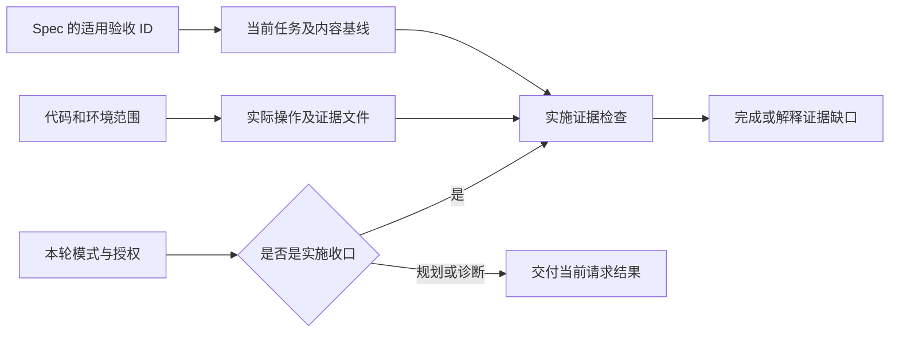
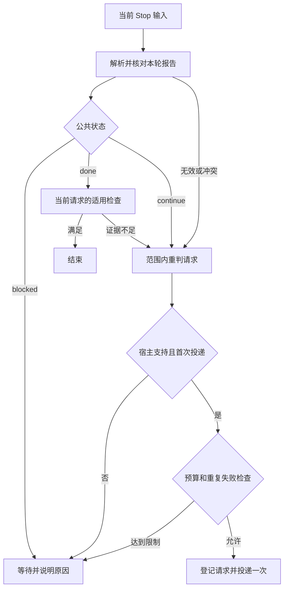

# 任务检查、停止状态与继续条件

## “完成了什么”先于“写了什么状态”

停止策略解决两个工程问题：Agent 不能因为一轮输出结束就遗忘已经授权但尚未完成的工作，也不能为了满足一个检查而无界续跑。它并不替用户定义产品验收，不负责授予新动作权限。

`done` 针对本轮请求：讨论产物已交付、诊断已说明事实与影响，都可以完成。实施请求则需要当前任务的适用证据。部署没有被请求时，未部署不阻塞开发任务；真实运行尚未验证时，也不能把代码检查通过说成真实运行通过。

图描述确定性关联。证据是否足以解释业务正确性仍需审阅，源码无法替代运行观察。

## 三种状态，原因和下一步单独说明

| 公共状态 | Agent 表达的意图 | Core 的正常控制结果 |
|---|---|---|
| `done` | 当前授权范围内的结果已经交付 | 适用检查满足后允许结束 |
| `continue` | 当前已确认阶段内有明确且已授权的下一步 | 在宿主能力和预算允许时请求继续 |
| `blocked` | 当前无法自主推进 | 不自动续跑，说明阻塞及解除条件 |

阶段交接等待用户确认时，不通过自动续跑进入后续产品阶段。仅要求就绪评估时，完成评估可以 `done`；承诺的整体工作尚未完成且需确认才能推进时，报告 `blocked`。续跑提示提醒遵守当前已确认阶段，但 Runtime 不理解成果的产品语义，也不能替用户或 Agent 判定确认是否充分。

阻塞可能需要用户取舍、凭据、人工应用操作，也可能是外部服务不可用。这些原因并不形成四条不同调度算法，因此作为 `reason` 与 `nextStep` 说明保存。结构化形式是 `WorkReport` 版本 2，包含 `protocolVersion` 和 `status`，可附原因与下一步。不会把原因枚举扩展成新的公共状态列表。

面向人类的尾行保持 `WORK_STATUS: done`、`WORK_STATUS: continue` 或 `WORK_STATUS: blocked`。裸 `blocked` 也有效；若没有结构化原因，Runtime 记为 `unknown`，不会猜成缺凭据或错误状态。Agent 仍有责任在正文解释阻塞。可选的 `| 原因` 后缀能够被读取，但不是必填的新手续。

## 文本与结构化报告怎样避免互相误导

文本解析只读回答末尾独立状态行。代码围栏、引用、缩进代码、行内举例和状态后仍有正文的行都不驱动控制；连续多个结尾声明被视为冲突。尾部引用元数据会先剥离，因此不会把引用块当新正文。

结构化报告可由 Hook 输入或 `.lumine/cli work-status` 提供。CLI 必须知道明确宿主与会话，可使用 `--report <文件或->` 读取 JSON，也可传状态及原因参数；`--expect-turn` 用于拒绝已变更用户轮次的写入。Runtime 只复用当前用户轮次、当前宿主轮次内尚未消费的报告，不能从任意较早一轮捡出 `done`。

`work-status`、任务与检查命令也经过统一 Node 薄入口：只有 Node 22.x 从 22.18.0 起或 Node 24.x 从 24.11.0 起才加载实现，推荐 Node 24 LTS。不支持时返回 `UNSUPPORTED_NODE_RUNTIME` 与升级动作，不写任务绑定、工作报告或宿主收据。它是启动失败诊断，不是第四种公共工作状态。

两种渠道同时存在时，状态、协议版本及明确提供的原因／下一步必须一致；缺少解释的一方可以由另一方补充，冲突时要求重报当前意图。仅修正文档里的例子不会触发继续工作，结构化状态也不能暗中覆盖人类看到的相反结尾。

## 当前任务检查与全项目检查不是同一个门槛

`done` 进入实施完成判断时读取当前绑定任务，验证验收基线、实际证据、适用源码与必要知识同步。未绑定实施任务会报告 `TASK_NOT_BOUND`；较新失败、源码漂移和缺少适用证据都不能被一个“通过”字符串掩盖。

当前 schemaVersion 3 任务同时记录知识影响与处置：需要同步时必须记录核实范围、知识引用和新增／修订／保留／暂缓决定；已登记的受影响来源必须匹配当前指纹，Runtime 不检查来源清单是否遗漏。每项决定绑定可恢复文档的当前内容哈希，并与任务引用关联；已登记来源或处置引用的内容变化后，旧声明不能继续当作当前通过证据。无知识增量可明确不需要同步。证据没有绑定某一 AC 时，只能说明记录中限定的操作通过，不会使所有产品验收自动通过。

`plan`、`verify`、`diagnose` 和显式检查请求的完成表示相应工作已交付，不要求先修好被检查对象。Runtime 不会把诊断失败转换成实施授权。`check health`、`check all` 是另行调用的项目检查，正常任务收口不会自动扫描并修复整个工程。

报告无效或实施证据不足时，内部可以产生 `reject_completion`，它表示需要范围内的重新判断或补充，既不是第四种公共工作状态，也不允许偷偷改验收。Agent 可以补已授权证据、修正自己的完成表述，或说明实际阻塞；不能为了“过门禁”部署服务、修改业务目标或修复未授权问题。

## 所有自动跟进都经过同一预算

默认一条自主继续链最多 20 次，项目可配置；ZCode 还受实现中的最多 3 次宿主上限约束。普通 `continue`、报告格式修正以及完成检查失败都扣同一预算。不能通过反复写 `done` 让检查拒绝，从另一条分支绕开上限。

相同失败、相同任务输入和可观察进度没有改变时，默认第二次出现就停止自动重试。一般进度检查只有在宿主明确提供可观察进度时才启用；没有进度信号表示“不知道”，不能声称观察到两轮毫无进展。即便进度未知，总链长限制仍有效。

预算针对逻辑续跑请求，不能证明宿主已经执行它。先登记再送达可能遇到进程中断，系统选择保守不重复投递；这避免重复动作，但意味着有些中断需要人工核实后恢复，而不是保证恰好执行一次。

## 重复事件、并发与新用户轮次

优先使用宿主的回答／消息／生成 ID 作为一次报告身份，Hook 调用 ID 只代表传输尝试，不应让同一个回答被重试时得到新预算。没有稳定回答 ID 时，使用会话、用户轮次、宿主轮次和回答文本组合去重。

同一报告身份重复到达，返回已算出的决定但不再次投递。相同身份携带不同报告时暂停并报告身份冲突。Stop 的文件锁避免同一会话并发评估都看到旧计数后各自发出续跑。锁若因中断残留，不自动超时抢占，应先核对进程和状态。

明确的新用户轮次会清除旧结束报告、待投递请求及旧模式，使旧任务绑定不再直接适用于本轮，并开启新的预算链。项目任务文件、已有进度和授权依据仍在；重新绑定当前工作是核对上下文，不是要求用户再批准一次。迁移也要保留已经消耗的预算，不把“换了协议”当作免费重置。

## 请求继续不等于证明已经自动继续

探针区分至少三件事：Stop 事件被调用、Adapter 返回了允许继续的协议、宿主因此启动后续工作。新的证明条件要求后续非 Stop 事件关联同一会话、同一用户轮次和准确的 `continuationRequestId`，并确认不是新的用户输入。

任意后续工具事件、稍后打开的新会话、手动发送“继续”或直接塞一个 `automatic_continuation` 标签，都不足以证明自动续跑。普通事件可以推进本地去重轮次，但没有匹配回执时仍保留“未证实送达”。未提供相关回执的宿主，不能凭本地静态配置显示自动续跑实测通过。

验证事件新增实际进程的 runtime 与版本记录，读取时按当前政策重新判断，不信任旧记录中的通过标签。`adapter status` 分开显示当前检查进程与已有宿主事件的进程；终端 Node 合格不能证明宿主 Hook 使用了同一个 Node。宿主事件没有实际 runtime 记录时仍属未观察；若最新记录是已不支持的 Node，不能显示为就绪。Bun 的 Node 兼容版本单独保存，嵌入宿主支持仍待独立验证。

当前源码和测试验证控制协议；本轮并未因此新增真实宿主完整续跑证据。历史 Codex 会话与 CLI 记录只证明记录中实际发生的入口行为，其他社区应用也不能借用这些证据。

## 维护与验证要保留什么

遇到预算限制、相同失败重现或状态冲突，先查看当前任务、会话轮次、最后报告和已登记请求，明确还剩什么工作及当前权限。不要删除会话文件来绕过预算，也不要把未知的待投递请求自动重放。锁冲突先确认原进程已结束，再依据受保护记录恢复。

协议升级属于独立维护工具：有效任务、模式、用户轮次、进度和已用预算保留；旧待投递动作保留为未知历史，当前运行需要新的报告。日常 Runtime 只执行当前三态协议，相关旧格式规则不注入 Skill 上下文。

修改此机制至少应覆盖：三态正常路径、示例不触发、文本与结构化冲突、同一事件多次投递、并发 Stop、20 次共享预算、ZCode 上限、重复失败、未知进度、诊断带失败完成、新轮次隔离，以及匹配和不匹配的续跑回执。单元测试能验证判定，真实宿主验收必须另外报告。

## 计划完成后仍可追溯

计划归档在 active 与 completed 之间移动，保留稳定 ID、验收与证据；只调整生命周期状态和必要相对链接。任务继续引用原 ID，不需要重新绑定要求。默认目录排除归档内容，显式 ID、路径和旧路径映射仍可定位当前协议的计划。恢复同一任务时可以受控移回；写入前核对内容指纹，中断可续跑，后续人工修改引发冲突而不会被覆盖。无身份或明确标为历史的记录不自动升级为当前任务。

<!-- lumine-wiki-metadata:v1
{
  "tags": [
    "停止策略",
    "三态",
    "续跑",
    "诊断",
    "任务检查",
    "WORK_STATUS",
    "WorkReport",
    "continuation",
    "stop policy"
  ],
  "aliases": [
    "停止策略",
    "三态",
    "续跑",
    "诊断",
    "任务检查",
    "WORK_STATUS",
    "WorkReport",
    "continuation",
    "stop policy"
  ],
  "repositories": [
    "project"
  ],
  "sources": [
    {
      "id": "task-check",
      "repoId": "project",
      "path": "skills/lumine-harness/src/harness/core/task-contract.ts",
      "startLine": 87,
      "endLine": 205,
      "kind": "source"
    },
    {
      "id": "stop-report",
      "repoId": "project",
      "path": "skills/lumine-harness/src/harness/core/stop-policy.ts",
      "startLine": 33,
      "endLine": 102,
      "kind": "source"
    },
    {
      "id": "stop-budget",
      "repoId": "project",
      "path": "skills/lumine-harness/src/harness/core/stop-policy.ts",
      "startLine": 104,
      "endLine": 133,
      "kind": "source"
    },
    {
      "id": "stop-lock",
      "repoId": "project",
      "path": "skills/lumine-harness/src/harness/core/stop-policy.ts",
      "startLine": 50,
      "endLine": 79,
      "kind": "source"
    },
    {
      "id": "terminal-parser",
      "repoId": "project",
      "path": "skills/lumine-harness/src/harness/core/work-status.ts",
      "startLine": 43,
      "endLine": 99,
      "kind": "source"
    },
    {
      "id": "report-state",
      "repoId": "project",
      "path": "skills/lumine-harness/src/harness/core/work-status.ts",
      "startLine": 352,
      "endLine": 403,
      "kind": "source"
    },
    {
      "id": "turn-state",
      "repoId": "project",
      "path": "skills/lumine-harness/src/harness/core/work-status.ts",
      "startLine": 252,
      "endLine": 349,
      "kind": "source"
    },
    {
      "id": "host-delivery",
      "repoId": "project",
      "path": "skills/lumine-harness/src/harness/core/continuation-delivery.ts",
      "startLine": 3,
      "endLine": 23,
      "kind": "source"
    },
    {
      "id": "receipt-evidence",
      "repoId": "project",
      "path": "skills/lumine-harness/src/harness/core/verification.ts",
      "startLine": 219,
      "endLine": 273,
      "kind": "source"
    },
    {
      "id": "proof-summary",
      "repoId": "project",
      "path": "skills/lumine-harness/src/harness/core/verification.ts",
      "startLine": 308,
      "endLine": 360,
      "kind": "source"
    },
    {
      "id": "report-cli",
      "repoId": "project",
      "path": "skills/lumine-harness/src/harness/adapter-manager.ts",
      "startLine": 957,
      "endLine": 977,
      "kind": "source"
    },
    {
      "id": "check-scope",
      "repoId": "project",
      "path": "skills/lumine-harness/src/harness/check-main.ts",
      "startLine": 17,
      "endLine": 126,
      "kind": "source"
    },
    {
      "id": "status-tests",
      "repoId": "project",
      "path": "skills/lumine-harness/src/harness/tests/status-protocol.test.ts",
      "startLine": 19,
      "endLine": 165,
      "kind": "source"
    },
    {
      "id": "document-lifecycle",
      "repoId": "project",
      "path": "skills/lumine-harness/src/harness/core/document-operations.ts",
      "startLine": 1,
      "endLine": 216,
      "kind": "source"
    },
    {
      "id": "stage-handoff",
      "repoId": "project",
      "path": "skills/lumine-harness/assets/skills/lumine-plan/references/stage-handoff.md",
      "kind": "source",
      "startLine": 1,
      "endLine": 45
    },
    {
      "id": "node-policy",
      "repoId": "project",
      "path": "skills/lumine-harness/src/harness/core/node-runtime.ts",
      "startLine": 1,
      "endLine": 59,
      "kind": "source"
    },
    {
      "id": "node-bootstrap",
      "repoId": "project",
      "path": "skills/lumine-harness/src/harness/core/node-bootstrap.ts",
      "startLine": 1,
      "endLine": 56,
      "kind": "source"
    },
    {
      "id": "check-entry",
      "repoId": "project",
      "path": "skills/lumine-harness/src/harness/check.ts",
      "startLine": 1,
      "endLine": 6,
      "kind": "source"
    },
    {
      "id": "task-entry",
      "repoId": "project",
      "path": "skills/lumine-harness/src/harness/core/task-cli.ts",
      "startLine": 1,
      "endLine": 5,
      "kind": "source"
    },
    {
      "id": "report-entry",
      "repoId": "project",
      "path": "skills/lumine-harness/src/harness/adapter-cli.ts",
      "startLine": 1,
      "endLine": 4,
      "kind": "source"
    },
    {
      "id": "runtime-process",
      "repoId": "project",
      "path": "skills/lumine-harness/src/harness/core/runtime-environment.ts",
      "startLine": 1,
      "endLine": 42,
      "kind": "source"
    },
    {
      "id": "runtime-receipt",
      "repoId": "project",
      "path": "skills/lumine-harness/src/harness/core/verification.ts",
      "startLine": 362,
      "endLine": 412,
      "kind": "source"
    },
    {
      "id": "runtime-status",
      "repoId": "project",
      "path": "skills/lumine-harness/src/harness/adapter-manager.ts",
      "startLine": 636,
      "endLine": 685,
      "kind": "source"
    }
  ],
  "relations": [
    {
      "target": "lumine-workflow",
      "kind": "depends_on",
      "note": "先理解任务模式、验收和证据归属"
    },
    {
      "target": "lumine-adapters",
      "kind": "related",
      "note": "续跑决策如何送达各宿主"
    },
    {
      "target": "lumine-root-config",
      "kind": "related",
      "note": "会话和任务记录的位置"
    },
    {
      "target": "lumine-wiki",
      "kind": "related",
      "note": "任务承担的知识同步如何完成"
    }
  ],
  "diagrams": [
    {
      "id": "checks",
      "title": "任务完成的证据路径",
      "caption": "保留原图身份。产品要求与当前代码和环境决定证据是否适用，当前请求模式决定是否进入实施完成检查。",
      "sources": [
        "task-check",
        "stop-report"
      ]
    },
    {
      "id": "bounded-continuation",
      "title": "停止判断与有界续跑",
      "caption": "无效报告和完成检查失败也必须经过相同预算与去重；图中等待只停止自动调度，不自动修改用户授权。",
      "sources": [
        "stop-report",
        "stop-budget",
        "stop-lock",
        "host-delivery"
      ]
    }
  ],
  "sections": [
    {
      "id": "status-answer",
      "sources": [
        "stop-report",
        "task-check"
      ]
    },
    {
      "id": "status-values",
      "sources": [
        "terminal-parser",
        "report-state",
        "stage-handoff"
      ]
    },
    {
      "id": "status-parsing",
      "sources": [
        "terminal-parser",
        "stop-report"
      ]
    },
    {
      "id": "status-checks",
      "sources": [
        "task-check",
        "check-scope"
      ]
    },
    {
      "id": "status-budget",
      "sources": [
        "stop-budget",
        "host-delivery"
      ]
    },
    {
      "id": "status-identity",
      "sources": [
        "stop-lock",
        "turn-state",
        "report-state"
      ]
    },
    {
      "id": "status-proof",
      "sources": [
        "receipt-evidence",
        "proof-summary"
      ]
    },
    {
      "id": "status-recovery",
      "sources": [
        "stop-lock",
        "report-cli",
        "status-tests"
      ]
    },
    {
      "id": "计划完成后仍可追溯",
      "sources": [
        "document-lifecycle"
      ]
    }
  ],
  "watchScopes": [
    {
      "repoId": "project",
      "path": "skills/lumine-harness/src/harness/core/task-contract.ts"
    },
    {
      "repoId": "project",
      "path": "skills/lumine-harness/src/harness/core/stop-policy.ts"
    },
    {
      "repoId": "project",
      "path": "skills/lumine-harness/src/harness/core/work-status.ts"
    },
    {
      "repoId": "project",
      "path": "skills/lumine-harness/src/harness/core/continuation-delivery.ts"
    },
    {
      "repoId": "project",
      "path": "skills/lumine-harness/src/harness/core/verification.ts"
    },
    {
      "repoId": "project",
      "path": "skills/lumine-harness/src/harness/adapter-manager.ts"
    },
    {
      "repoId": "project",
      "path": "skills/lumine-harness/src/harness/check.ts"
    },
    {
      "repoId": "project",
      "path": "skills/lumine-harness/src/harness/tests/status-protocol.test.ts"
    },
    {
      "repoId": "project",
      "path": "skills/lumine-harness/src/harness/core/document-operations.ts"
    },
    {
      "repoId": "project",
      "path": "skills/lumine-harness/src/harness/check-main.ts"
    },
    {
      "repoId": "project",
      "path": "skills/lumine-harness/assets/skills/lumine-plan/references/stage-handoff.md"
    },
    {
      "repoId": "project",
      "path": "skills/lumine-harness/src/harness/core/node-runtime.ts"
    },
    {
      "repoId": "project",
      "path": "skills/lumine-harness/src/harness/core/node-bootstrap.ts"
    },
    {
      "repoId": "project",
      "path": "skills/lumine-harness/src/harness/core/task-cli.ts"
    },
    {
      "repoId": "project",
      "path": "skills/lumine-harness/src/harness/adapter-cli.ts"
    },
    {
      "repoId": "project",
      "path": "skills/lumine-harness/src/harness/core/runtime-environment.ts"
    }
  ]
}
-->
