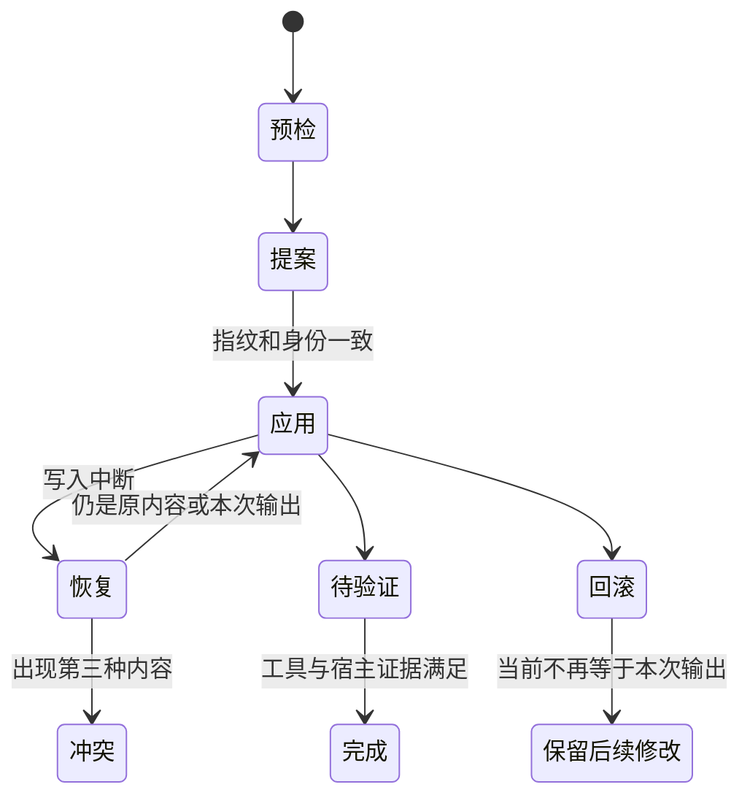

# 首次采用、升级与迁移恢复

## 先确定目标与语言，再决定写什么

维护入口先核对执行它的实际 Node 进程，再检查实际根、子仓、规则、配置和未提交修改。显式语言优先于项目已有配置；没有选择的非交互新项目默认英文。语言在资源选取与提案签名之前确定，apply 不重新选择。所选 Adapter 决定安装入口；未选择的社区 Adapter 仍在规范包，不要求每个用户都打开对应产品。

维护入口与日常 Runtime 支持 Node 22.x 从 22.18.0 起、Node 24.x 从 24.11.0 起，推荐 Node 24 LTS。薄启动层在加载维护实现前拒绝不支持的版本，输出版本与升级动作；`inspect`、准备提案、应用、续跑、回滚和 finalize 都遵循这一入口约束。拒绝时不修改目标文件、提案、恢复日志或用户 Node 配置，也不自动安装、切换运行环境。

`createProposal` 生成逐文件 operation，记录 before／after 哈希、内容、来源哈希、模式和权限。未修改的受管资源可更新；人工改过的入口、文档和 Skills 保留，其他不明冲突显式列出。合并项目约束通过具体 overrides 进入同一提案，不能以“保留文件”为理由让新旧工作方式并行。

已有授权覆盖本次具体改造时继续；提案本身不增加提交、推送或外部部署权限。源仓自用显式选择 sourceSelfUse，保留维护者规则并使用规范 Skill／Runtime，不套用一般项目模板覆盖源码仓约定。

## 安装工具之后，知识仍由 Agent 建设

首次采用后，当前 Agent 按知识指导理解主要能力与依赖、规划适应项目的目录、分批撰写并核实内容。默认覆盖主要模块，用户可以缩小范围或延后；程序不根据目录名自动填满前端、后端、部署模板。大项目保存完成主题与恢复位置，工具安装、知识覆盖、语义验收分别报告。

升级不默认重建全库。它更新受管理规范与工具，并在必要时用独立迁移模块转换格式。已有知识的内容价值、人工差异和历史证据属于项目，不能因为 Runtime 升版重新生成。

阅读器升级先写动态 chunk、样式和依赖，再切换稳定的 `reader.js` 入口。旧目标独有、原先受管且哈希未变的图解 chunk 与许可旁文件保留，提案保存其指纹，并合并对应许可声明；apply、rollback 和 finalize 都拒绝保留资产的后续漂移。保留旧资源让已经打开的旧入口仍可加载依赖，也会累积资产体积。回滚按提案恢复旧字节并移除该次新增资源；已经打开的新入口可能因按需资源被移除而失败，阅读器提供整页重新载入入口，不把回滚当作无缝热切换。

## 续跑接受两种状态，第三种必须保护

恢复日志与备份在 Runtime 树之外的 `.lumine-migrations/`。写入前保存原字节与权限，临时文件原子替换，逐项记录。中断后的 apply 仅接受提案旧内容或已经写入的新内容；第三种内容表示有人修改，不强行覆盖。回滚也只恢复仍匹配本次输出的文件，后续人工修改列为冲突而保留。

升级前需保存可独立定位的原维护工具包及其依赖，并核对实际运行环境。恢复日志保存原字节与操作身份，不会自动成为可执行的旧工具；新入口不能为回滚静默放宽版本检查。可用受支持 Node 运行新维护工具，或按旧分发原有支持范围使用保留的旧工具处理旧事务。Node 支持策略变化不授权删除备份、历史证据、活动工作包或后续人工修改。

这些机制是每个项目的恢复保证，不能推出多仓原子事务。源仓与采用项目需要主执行记录串行协调。恢复文件可能是唯一资料，不能随意清理整个 local 或迁移备份目录。

## 格式转换不重新解释历史

知识转换同时处理当前正文、上次生成正文、保存候选与工作包。原有无类型关系仅转换为 related，不猜测依赖或决策；已有章节 ID 保留，缺失的稳定锚点固定原章节引用。原文人工差异不会被吸收成生成基线。初始目录只是现有页面盘点，保持 partial；没有模型核实就不能显示全面覆盖或语义通过。

预检发现未完成旧写入事务时阻止转换，要求用当前已安装的恢复能力处理，原材料保持不变。apply、finalize 和 rollback 共用 Wiki 写锁；应用前和收口时重新盘点待转换资产与未完成事务，防止提案之后旧写入器留下遗漏。出现提案未包含的旧格式资产时重新准备提案，不越过原操作指纹覆盖。格式标记最后写入，且不能单凭标记跳过复核。已完成事务与历史证据保留历史身份，不修改成新一轮验收。

状态转换保留任务绑定、模式、范围、授权依据、进度、Skill 版本与已消耗预算。未知是否送达的续跑请求不重放，迁移后需要新工作报告。损坏或身份不明的会话保留并诊断，不清零预算假装新会话。旧名称识别只在独立迁移实现及测试，不进入四个日常 Skills。

## 宿主切换与资产保护

目录迁移可能需要临时旧 Hook 转发，刷新宿主取得新入口调用证据后退出；已经完成的 `.harness` 到 `.lumine` 迁移不重复执行。正常升级沿用当前入口，配置存在、Hook 调用、续跑送达和人类接受仍分别判断。当前用户只使用 Codex，其他 Adapter 的协议回归不等于它们已在本机运行。

取消选用宿主时，只删除有受管所有权且未变的入口文件；混合配置保持待合并，不能删除整个宿主目录。Wiki 状态、任务、项目检查扩展和私有材料不进入普通工具文件淘汰逻辑。更改安装器时重点验证不同写入阶段失败、幂等恢复、语言锁定、后续人工修改回滚保护、会话预算和知识基线差异。

<!-- lumine-wiki-metadata:v1
{
  "tags": [
    "adoption",
    "upgrade",
    "迁移",
    "恢复"
  ],
  "aliases": [
    "adoption",
    "upgrade",
    "迁移",
    "恢复",
    "createProposal",
    "applyProposal",
    "rollbackProposal",
    "finalizeProposal"
  ],
  "repositories": [
    "project"
  ],
  "sources": [
    {
      "id": "manager",
      "repoId": "project",
      "path": "skills/lumine-harness/src/scripts/harness-manager-main.ts",
      "startLine": 1,
      "endLine": 1050,
      "kind": "source"
    },
    {
      "id": "legacy",
      "repoId": "project",
      "path": "skills/lumine-harness/src/migration/legacy.ts",
      "startLine": 1,
      "endLine": 214,
      "kind": "source"
    },
    {
      "id": "knowledge",
      "repoId": "project",
      "path": "skills/lumine-harness/src/migration/knowledge.ts",
      "startLine": 1,
      "endLine": 122,
      "kind": "source"
    },
    {
      "id": "status",
      "repoId": "project",
      "path": "skills/lumine-harness/src/migration/work-status.ts",
      "startLine": 1,
      "endLine": 84,
      "kind": "source"
    },
    {
      "id": "adoption",
      "repoId": "project",
      "path": "skills/lumine-harness/references/adoption.md",
      "startLine": 1,
      "endLine": 24,
      "kind": "source"
    },
    {
      "id": "tests",
      "repoId": "project",
      "path": "skills/lumine-harness/src/harness/tests/adoption-manager.test.ts",
      "startLine": 1,
      "endLine": 429,
      "kind": "source"
    },
    {
      "id": "wiki-tests",
      "repoId": "project",
      "path": "skills/lumine-harness/src/harness/tests/migration-knowledge.test.ts",
      "startLine": 1,
      "endLine": 210,
      "kind": "source"
    },
    {
      "id": "node-policy",
      "repoId": "project",
      "path": "skills/lumine-harness/src/harness/core/node-runtime.ts",
      "startLine": 1,
      "endLine": 59,
      "kind": "source"
    },
    {
      "id": "node-bootstrap",
      "repoId": "project",
      "path": "skills/lumine-harness/src/harness/core/node-bootstrap.ts",
      "startLine": 1,
      "endLine": 56,
      "kind": "source"
    },
    {
      "id": "manager-entry",
      "repoId": "project",
      "path": "skills/lumine-harness/src/scripts/harness-manager.ts",
      "startLine": 1,
      "endLine": 10,
      "kind": "source"
    }
  ],
  "relations": [
    {
      "target": "lumine-architecture",
      "kind": "related",
      "note": "规范资产和分发边界"
    },
    {
      "target": "lumine-root-config",
      "kind": "related",
      "note": "根身份决定有效运行位置"
    },
    {
      "target": "lumine-wiki",
      "kind": "related",
      "note": "知识基线和事务作为项目资产"
    },
    {
      "target": "lumine-task-check",
      "kind": "related",
      "note": "迁移后需要新报告，不能重放不明续跑"
    },
    {
      "target": "lumine-wiki-reader#reader-failures-and-validation",
      "kind": "related",
      "note": "静态资源失效后的整页恢复入口由阅读器提供"
    }
  ],
  "watchScopes": [
    {
      "repoId": "project",
      "path": "skills/lumine-harness/src/scripts/harness-manager.ts"
    },
    {
      "repoId": "project",
      "path": "skills/lumine-harness/src/migration/legacy.ts"
    },
    {
      "repoId": "project",
      "path": "skills/lumine-harness/src/migration/knowledge.ts"
    },
    {
      "repoId": "project",
      "path": "skills/lumine-harness/src/migration/work-status.ts"
    },
    {
      "repoId": "project",
      "path": "skills/lumine-harness/references/adoption.md"
    },
    {
      "repoId": "project",
      "path": "skills/lumine-harness/src/harness/tests/adoption-manager.test.ts"
    },
    {
      "repoId": "project",
      "path": "skills/lumine-harness/src/harness/tests/migration-knowledge.test.ts"
    },
    {
      "repoId": "project",
      "path": "skills/lumine-harness/src/scripts/harness-manager-main.ts"
    },
    {
      "repoId": "project",
      "path": "skills/lumine-harness/src/harness/core/node-runtime.ts"
    },
    {
      "repoId": "project",
      "path": "skills/lumine-harness/src/harness/core/node-bootstrap.ts"
    }
  ],
  "diagrams": [
    {
      "id": "migration",
      "title": "提案、应用与恢复的边界",
      "caption": "每个项目独立推进；输入漂移停止覆盖，宿主证据不能用静态测试或其他会话冒充。",
      "sources": [
        "manager",
        "knowledge",
        "status",
        "node-policy",
        "node-bootstrap"
      ]
    }
  ]
}
-->
