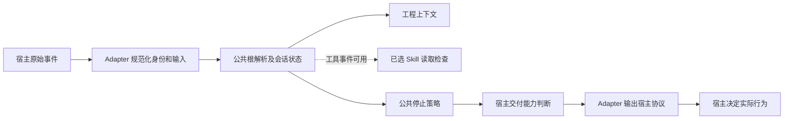
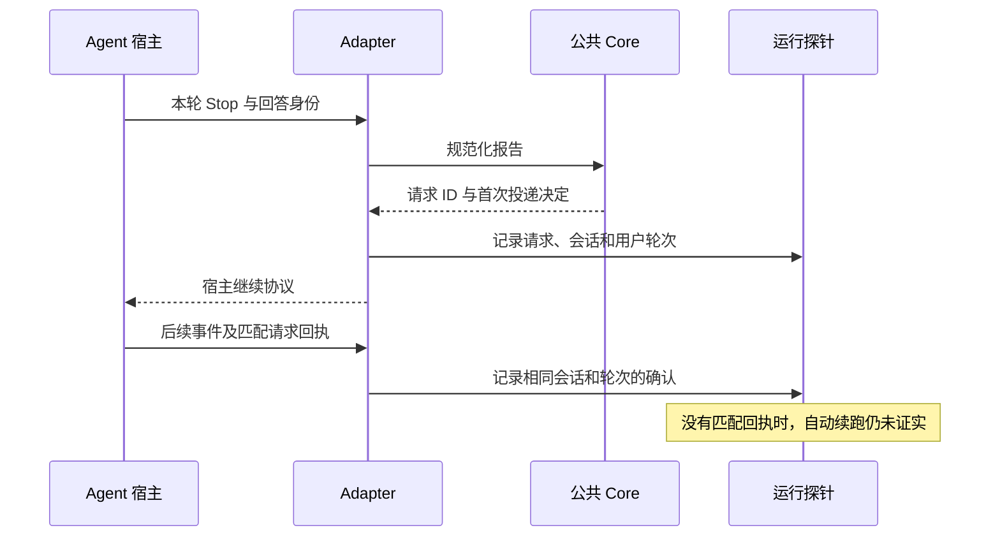

# Adapter 公共协议与各宿主差异

## 共用工程规则，不假设所有应用一样

Lumine 的公共 Core 决定任务模式、证据、Skill 读取关联和停止策略。Adapter 接收某个 Agent 应用的事件，转换为 Core 能理解的输入，再把结果转换回该应用支持的输出。它不会成为另一份工程规则，也不会复制业务 Skill 正文。

外部 Node Hook 使用与 CLI 相同的版本策略：支持 Node 22.x 从 22.18.0 起、Node 24.x 从 24.11.0 起，推荐 Node 24 LTS。低语法入口在读取事件输入、查找项目根与动态加载实现之前拒绝不支持的进程；不会为失败的入口写入新的宿主执行证据。Hook 的错误返回仍受各宿主失败行为约束，宿主放行不等于 Harness 已执行。

OpenCode 在宿主进程中嵌入 Core，入口先区分实际 runtime：真正的 Node 遵循 Node 策略，Bun 的兼容 Node 版本不用于硬拒绝 Bun，也不用于宣称 Bun 已验证。内部插件实现放在 `.lumine/adapters/opencode/`，插件发现目录只保留薄入口；共同 Core 被导入时不全局硬拦截嵌入宿主。

这是一条重要的可维护性边界：增加宿主应主要增加协议转换与能力声明，而不是再实现一套“什么算完成”。但共用 Core 不能让宿主凭空提供事件。没有停止前控制点的应用只能做审计；没有工具读取事件的应用不能证明 Skill 已读；需要用户启用 Hook 的应用也不能因为项目里已有配置就视为接入完成。

## 一次事件怎样穿过公共层

输入规范化保留宿主、会话、工作目录、用户轮次、事件 ID、回答 ID、最终文本，以及可选的结构化报告和续跑回执。**事件 ID 与回答 ID 分开**：同一个回答可能导致多次 Hook 调用，不能把传输重试当成 Agent 又完成了一轮工作。

进入项目后，共用根解析确定规范规则、Skill 和 Runtime。会话开始或提交提示时注入简短工程地图；提供工具事件的宿主还能记录规范 Skill 读取，并对已选择但未读取的能力设置修改前提醒或门禁。结束事件进入同一个 Stop Policy：它判断本轮完成、可继续或阻塞，并在预算及去重后决定是否投递下一步。

图中“公共停止策略”只生成受约束的跟进请求，不直接调用模型。`automatic` 是这条 Adapter 代码选择的交付方式，仍需实际事件证明宿主接受并执行。

## 各宿主在当前实现中的关键差异

| 宿主 | 当前实现接入点 | 继续工作的输出或行为 | 不能据此推断的事 |
|---|---|---|---|
| Codex | SessionStart 注入；Stop 读取结束报告 | `decision: block` 加原因，阻止本次停止 | 不证明规范 Skill 实际全文读取，也不证明新版本自动续跑已完成 |
| Qoder | 提示提交、工具前后和 Stop | Stop 使用 `decision: block`；工具事件核对已选 Skill 读取 | Lumine 的 Wiki 不是调用 Qoder 内置 Repo Wiki，两个系统没有自动同步关系 |
| Trae | 会话开始与 Stop | `decision: block` 加原因 | 项目文件不能替代应用内导入规则、Skill 和 Hook 设置 |
| Cursor | 会话开始、回答后事件及 Stop | `followup_message`；明确为非 completed 的 Stop 会跳过；缺少 status 时仍处理 | 回答缓存和 transcript 回退不是自动续跑的独立证据 |
| Kimi Code | 用户级 dispatcher 接 SessionStart／Stop | 需要继续时退出码 2，并把原因写入 stderr | Hook 失败默认放行，不能作唯一安全门禁；状态需显式记录 |
| CodeBuddy | SessionStart、提示提交、工具前后和 Stop | Stop 的 `continue: false` 加原因，表示阻止停止 | 同名字段在别的宿主可能不同，不能全仓统一替换 JSON |
| ZCode | 本地 Hook Plugin 提供完整事件分派 | `decision: block`；Core 限制连续最多 3 次 | 本地插件已存在不等于已加入并启用 |
| DeepSeek Harness | profile Hook bridge 与原生 Skill 读取线索 | `decision: block`，工具前检查已选能力 | 仓库回归仅覆盖注明的协议版本，开发预览不等于全部发布版兼容 |
| OpenCode | system transform、压缩上下文、工具审计、`session.idle` | 没有对等 Stop Gate；需要人发起下一轮 | idle 已发生在停止之后，不能宣称能阻止过早结束 |

这张表以当前仓库实现为准。CodeBuddy 的 Stop 字段还核对了[官方 Hook 参考](https://www.codebuddy.ai/docs/cli/hooks)：该事件的 `continue: false` 用来阻止停止；不能照搬其他事件或产品对 `continue` 的解释。它只补足协议依据，不构成本地真实运行验收。

Qoder、CodeBuddy 和 ZCode 使用 Adapter 定位规范 Skill 文件；DeepSeek 的工具后事件还接收原生 Skill 加载线索。读取判断针对实际选择的 Skill 与当前文件内容，不能用关键词搜索结果替代已读记录。所有宿主使用相同项目资料，不生成各自可编辑的 Skill 副本。

## 设置就绪和能力证据怎样分别看

Adapter 诊断先看项目是否选择了该宿主、所需资产是否存在、产品设置是否仍待完成。Trae 的应用内导入、Cursor 的工程信任、CodeBuddy 的 `/hooks` 审核、ZCode 的插件启用和 DeepSeek 的 profile 安装都属于宿主设置，不是新的任务完成状态。

Kimi 需要用户级配置：安装器先构造临时 TOML、调用可用校验、保留原文件备份，再写入受管块与 dispatcher；无关配置保留。此操作需要单独授权，不能把普通项目采用扩展为静默更改用户环境。卸载同样只退出自己的受管部分，并先校验候选配置。

`adapter status`、`doctor` 和 `verify` 回答不同问题：能否开始使用、配置或设置哪里有缺口、真实记录证明了哪些能力。输出中 `repository_checked` 只表示仓库实现检查；`runtime_observed` 才表示在具体会话中观察到事件；`behavior_verified` 需要适用行为证据。`not_tested`、`not_observable` 和 `not_applicable` 不应显示成通过。

`adapter status` 还分别返回检查命令进程和已有宿主事件的实际 runtime。验证事件记录 `processRuntime`，读取时重新核对 Node 支持策略；缺少实际进程记录仍为未观察，最新宿主事件使用不支持的 Node 则返回连接问题与升级动作。仅在终端运行新 Node、保存配置或旧事件中标记通过，都不能替代当前宿主版本证据。Bun 与未知 runtime 的正式支持保持未验证。

Skill 选择声明与宿主观察分开。任务绑定的 `readObservability: not_observable` 明确表达协议缺口，`read: false` 只表示未观察到；Codex 不会仅因此阻塞证据充分的任务完成。探针也不会把 Agent 自报的读取标签升成该宿主的真实读取能力证明。

“需要人工设置”是 Adapter 就绪诊断的一种情况，不属于公共 `WORK_STATUS` 的新状态；若阻塞当前任务，Agent 用 `blocked` 并解释具体设置步骤。

## 真实续跑证据必须关联到原请求

探针只在明确的验证运行内记录事件，不把所有聊天正文复制进公开文档。自动续跑的判定要求后续非 Stop 事件带回正确请求 ID，并且会话、用户轮次一致、不是新的用户输入。普通后续事件不够；手动发“继续”不够；直接给探针写一个能力标签也不够。

当前大多数 Adapter 输出不会让宿主自动回传这个内部请求 ID。因此仓库测试能验证关联规则，真实能力仍可能是未证实。不能为了让面板变绿而自行伪造回执；后续应在宿主提供可信关联机制时适配，并用真实会话验证。

现有历史验收明确：父项目刷新 Codex 后观察到 SessionStart，源仓在真实 Codex 会话运行新 CLI；独立源仓完整 SessionStart／Stop 链、自动续跑及社区应用行为没有因此全部验证。此页保留这一边界；本次三态升级的测试也不能追溯改写旧探针为新协议实测通过。

## 异常与恢复先定位在哪一层

没有上下文时先核对根与设置，再看宿主是否调用入口；读取门禁异常时先看当前选中的规范 Skill 及其内容版本；停止后没有继续时，再区分 Core 已暂停、预算耗尽、重复事件被去重，还是宿主没有接受输出。不要从“没有下一条消息”直接推断模型不遵守规则。

Cursor 的回答后事件保存最后文本，Stop 可从会话缓存或 transcript 回退。恢复时要注意文本来自哪一轮；这条回退并不提供用户轮次或续跑关联的完整证明。OpenCode 的 idle 审计同样只能说明空闲事件发生，不能恢复已经结束的本轮动作。

Hook 执行失败、路径错误或残留锁属于不同失败；先保留输入身份、错误和状态，再修正当前层。可以刷新或重新开启宿主会话加载新入口，但不能把刷新本身当作自动续跑验收。社区 Adapter 没有在本机安装时，报告协议和分发回归即可，不要求为了普通业务任务安装所有应用。

## 增加或修改 Adapter 时怎样验收

公共修改优先在 Core 完成，再检查每种输出映射。至少覆盖缺失会话身份、从子仓启动、重复回答、多会话并行、新用户轮次、已选 Skill 读取、三态转换、报告修正共享预算和宿主不支持的情况。不能让某个 Adapter 为 `reject_completion` 绕过公共预算再发一次。

源码与正式分发都要执行协议回归；真实宿主测试另行记录应用版本、事件、适用范围和未观察能力。扩大公开支持声明前核对官方协议及当前宿主版本。这里的机制与差异由源码和注明的官方资料支持；关于设计收益的解释属于工程推断，不是所有宿主均已成功运行的结论。

<!-- lumine-wiki-metadata:v1
{
  "tags": [
    "Adapter",
    "宿主兼容",
    "Codex",
    "Qoder",
    "Trae",
    "Cursor",
    "Kimi",
    "CodeBuddy",
    "ZCode",
    "DeepSeek",
    "OpenCode",
    "hooks",
    "host protocol"
  ],
  "aliases": [
    "Adapter",
    "宿主兼容",
    "Codex",
    "Qoder",
    "Trae",
    "Cursor",
    "Kimi",
    "CodeBuddy",
    "ZCode",
    "DeepSeek",
    "OpenCode",
    "hooks",
    "host protocol"
  ],
  "repositories": [
    "project"
  ],
  "sources": [
    {
      "id": "normalization",
      "repoId": "project",
      "path": "skills/lumine-harness/src/harness/core/hook-io.ts",
      "startLine": 42,
      "endLine": 70,
      "kind": "source"
    },
    {
      "id": "context",
      "repoId": "project",
      "path": "skills/lumine-harness/src/harness/core/session-context.ts",
      "startLine": 20,
      "endLine": 58,
      "kind": "source"
    },
    {
      "id": "delivery",
      "repoId": "project",
      "path": "skills/lumine-harness/src/harness/core/continuation-delivery.ts",
      "startLine": 3,
      "endLine": 23,
      "kind": "source"
    },
    {
      "id": "codex-start",
      "repoId": "project",
      "path": "skills/lumine-harness/src/harness/adapters/codex/hooks/session-start.main.ts",
      "startLine": 14,
      "endLine": 27,
      "kind": "source"
    },
    {
      "id": "codex-stop",
      "repoId": "project",
      "path": "skills/lumine-harness/src/harness/adapters/codex/hooks/lib/stop-gate.ts",
      "startLine": 10,
      "endLine": 25,
      "kind": "source"
    },
    {
      "id": "qoder-prompt",
      "repoId": "project",
      "path": "skills/lumine-harness/src/harness/adapters/qoder/hooks/prompt-submit.main.ts",
      "startLine": 8,
      "endLine": 29,
      "kind": "source"
    },
    {
      "id": "qoder-stop",
      "repoId": "project",
      "path": "skills/lumine-harness/src/harness/adapters/qoder/hooks/stop.main.ts",
      "startLine": 7,
      "endLine": 24,
      "kind": "source"
    },
    {
      "id": "trae-stop",
      "repoId": "project",
      "path": "skills/lumine-harness/src/harness/adapters/trae/hooks/stop.main.ts",
      "startLine": 7,
      "endLine": 24,
      "kind": "source"
    },
    {
      "id": "cursor-response",
      "repoId": "project",
      "path": "skills/lumine-harness/src/harness/adapters/cursor/hooks/after-agent-response.main.ts",
      "startLine": 5,
      "endLine": 19,
      "kind": "source"
    },
    {
      "id": "cursor-stop",
      "repoId": "project",
      "path": "skills/lumine-harness/src/harness/adapters/cursor/hooks/stop.main.ts",
      "startLine": 9,
      "endLine": 42,
      "kind": "source"
    },
    {
      "id": "kimi-dispatch",
      "repoId": "project",
      "path": "skills/lumine-harness/src/harness/adapters/kimi/hooks/dispatch.main.ts",
      "startLine": 12,
      "endLine": 32,
      "kind": "source"
    },
    {
      "id": "kimi-install",
      "repoId": "project",
      "path": "skills/lumine-harness/src/harness/adapter-manager.ts",
      "startLine": 887,
      "endLine": 955,
      "kind": "source"
    },
    {
      "id": "codebuddy-dispatch",
      "repoId": "project",
      "path": "skills/lumine-harness/src/harness/adapters/codebuddy/hooks/dispatch.main.ts",
      "startLine": 51,
      "endLine": 132,
      "kind": "source"
    },
    {
      "id": "zcode-dispatch",
      "repoId": "project",
      "path": "skills/lumine-harness/src/harness/adapters/zcode/hooks/dispatch.main.ts",
      "startLine": 45,
      "endLine": 145,
      "kind": "source"
    },
    {
      "id": "deepseek-dispatch",
      "repoId": "project",
      "path": "skills/lumine-harness/src/harness/adapters/deepseek-harness/hooks/dispatch.main.ts",
      "startLine": 45,
      "endLine": 131,
      "kind": "source"
    },
    {
      "id": "opencode-plugin",
      "repoId": "project",
      "path": "skills/lumine-harness/src/harness/adapters/opencode/plugin-main.ts",
      "startLine": 13,
      "endLine": 44,
      "kind": "source"
    },
    {
      "id": "setup-diagnostics",
      "repoId": "project",
      "path": "skills/lumine-harness/src/harness/adapter-manager.ts",
      "startLine": 418,
      "endLine": 515,
      "kind": "source"
    },
    {
      "id": "probe-evidence",
      "repoId": "project",
      "path": "skills/lumine-harness/src/harness/core/verification.ts",
      "startLine": 219,
      "endLine": 412,
      "kind": "source"
    },
    {
      "id": "host-history",
      "repoId": "project",
      "path": "docs/validation/lumine-refactor/2026-09-29/README.md",
      "startLine": 20,
      "endLine": 28,
      "kind": "source",
      "note": "历史验收范围；不是当前协议的自动续跑证明"
    },
    {
      "id": "skill-observability",
      "repoId": "project",
      "path": "skills/lumine-harness/src/harness/core/work-status.ts",
      "startLine": 378,
      "endLine": 393,
      "kind": "source"
    },
    {
      "id": "node-policy",
      "repoId": "project",
      "path": "skills/lumine-harness/src/harness/core/node-runtime.ts",
      "startLine": 1,
      "endLine": 59,
      "kind": "source"
    },
    {
      "id": "node-bootstrap",
      "repoId": "project",
      "path": "skills/lumine-harness/src/harness/core/node-bootstrap.ts",
      "startLine": 1,
      "endLine": 56,
      "kind": "source"
    },
    {
      "id": "codex-start-entry",
      "repoId": "project",
      "path": "skills/lumine-harness/src/harness/adapters/codex/hooks/session-start.ts",
      "startLine": 1,
      "endLine": 6,
      "kind": "source"
    },
    {
      "id": "qoder-prompt-entry",
      "repoId": "project",
      "path": "skills/lumine-harness/src/harness/adapters/qoder/hooks/prompt-submit.ts",
      "startLine": 1,
      "endLine": 6,
      "kind": "source"
    },
    {
      "id": "qoder-stop-entry",
      "repoId": "project",
      "path": "skills/lumine-harness/src/harness/adapters/qoder/hooks/stop.ts",
      "startLine": 1,
      "endLine": 6,
      "kind": "source"
    },
    {
      "id": "trae-stop-entry",
      "repoId": "project",
      "path": "skills/lumine-harness/src/harness/adapters/trae/hooks/stop.ts",
      "startLine": 1,
      "endLine": 6,
      "kind": "source"
    },
    {
      "id": "cursor-response-entry",
      "repoId": "project",
      "path": "skills/lumine-harness/src/harness/adapters/cursor/hooks/after-agent-response.ts",
      "startLine": 1,
      "endLine": 6,
      "kind": "source"
    },
    {
      "id": "cursor-stop-entry",
      "repoId": "project",
      "path": "skills/lumine-harness/src/harness/adapters/cursor/hooks/stop.ts",
      "startLine": 1,
      "endLine": 6,
      "kind": "source"
    },
    {
      "id": "kimi-dispatch-entry",
      "repoId": "project",
      "path": "skills/lumine-harness/src/harness/adapters/kimi/hooks/dispatch.ts",
      "startLine": 1,
      "endLine": 19,
      "kind": "source"
    },
    {
      "id": "codebuddy-dispatch-entry",
      "repoId": "project",
      "path": "skills/lumine-harness/src/harness/adapters/codebuddy/hooks/dispatch.ts",
      "startLine": 1,
      "endLine": 19,
      "kind": "source"
    },
    {
      "id": "zcode-dispatch-entry",
      "repoId": "project",
      "path": "skills/lumine-harness/src/harness/adapters/zcode/hooks/dispatch.ts",
      "startLine": 1,
      "endLine": 19,
      "kind": "source"
    },
    {
      "id": "deepseek-dispatch-entry",
      "repoId": "project",
      "path": "skills/lumine-harness/src/harness/adapters/deepseek-harness/hooks/dispatch.ts",
      "startLine": 1,
      "endLine": 19,
      "kind": "source"
    },
    {
      "id": "opencode-entry",
      "repoId": "project",
      "path": "skills/lumine-harness/src/opencode/plugins/harness.ts",
      "startLine": 1,
      "endLine": 11,
      "kind": "source"
    },
    {
      "id": "runtime-process",
      "repoId": "project",
      "path": "skills/lumine-harness/src/harness/core/runtime-environment.ts",
      "startLine": 1,
      "endLine": 42,
      "kind": "source"
    },
    {
      "id": "runtime-status",
      "repoId": "project",
      "path": "skills/lumine-harness/src/harness/adapter-manager.ts",
      "startLine": 636,
      "endLine": 685,
      "kind": "source"
    },
    {
      "id": "hook-bootstrap",
      "repoId": "project",
      "path": "skills/lumine-harness/src/harness/adapters/hook-bootstrap.ts",
      "startLine": 1,
      "endLine": 12,
      "kind": "source"
    },
    {
      "id": "kimi-installed",
      "repoId": "project",
      "path": "skills/lumine-harness/src/harness/adapters/kimi/installed-dispatcher.ts",
      "startLine": 1,
      "endLine": 35,
      "kind": "source"
    },
    {
      "id": "zcode-installed",
      "repoId": "project",
      "path": "skills/lumine-harness/src/harness/adapters/zcode/marketplace/plugins/lumine-harness-adapter/hooks/installed-dispatcher.ts",
      "startLine": 1,
      "endLine": 35,
      "kind": "source"
    }
  ],
  "relations": [
    {
      "target": "lumine-architecture",
      "kind": "related",
      "note": "回到 Core、Skill、Adapter 的整体职责"
    },
    {
      "target": "lumine-root-config",
      "kind": "depends_on",
      "note": "Hook 与 CLI 共用项目根解析"
    },
    {
      "target": "lumine-workflow",
      "kind": "related",
      "note": "实际选择与读取规范 Skill"
    },
    {
      "target": "lumine-task-check",
      "kind": "depends_on",
      "note": "所有宿主共用三态停止策略"
    },
    {
      "target": "lumine-adoption",
      "kind": "related",
      "note": "设置、升级和恢复入口"
    }
  ],
  "diagrams": [
    {
      "id": "adapter-lifecycle",
      "title": "统一 Core 与宿主协议之间的边界",
      "caption": "不同宿主提供不同事件，虚线表示有些宿主没有该观察点。所有继续请求先通过 Core，输出本身不证明宿主已经执行。",
      "sources": [
        "normalization",
        "context",
        "codex-stop",
        "codebuddy-dispatch",
        "delivery"
      ]
    },
    {
      "id": "continuation-proof",
      "title": "怎样证明一次自动续跑",
      "caption": "只有后续事件带回与当前会话和用户轮次一致的请求回执，才能把“请求继续”提升为“观察到继续”；手动新轮次不算。",
      "sources": [
        "probe-evidence",
        "delivery"
      ]
    }
  ],
  "sections": [
    {
      "id": "adapters-answer",
      "sources": [
        "normalization",
        "context"
      ]
    },
    {
      "id": "adapters-lifecycle",
      "sources": [
        "normalization",
        "context",
        "delivery"
      ]
    },
    {
      "id": "adapters-hosts",
      "sources": [
        "codex-start",
        "codex-stop",
        "qoder-prompt",
        "qoder-stop",
        "trae-stop",
        "cursor-response",
        "cursor-stop",
        "kimi-dispatch",
        "codebuddy-dispatch",
        "zcode-dispatch",
        "deepseek-dispatch",
        "opencode-plugin"
      ]
    },
    {
      "id": "adapters-setup",
      "sources": [
        "setup-diagnostics",
        "kimi-install",
        "skill-observability"
      ]
    },
    {
      "id": "adapters-evidence",
      "sources": [
        "probe-evidence",
        "host-history"
      ]
    },
    {
      "id": "adapters-failure",
      "sources": [
        "cursor-stop",
        "opencode-plugin",
        "setup-diagnostics"
      ]
    },
    {
      "id": "adapters-change",
      "sources": [
        "normalization",
        "delivery",
        "probe-evidence"
      ]
    }
  ],
  "watchScopes": [
    {
      "repoId": "project",
      "path": "skills/lumine-harness/src/harness/core/hook-io.ts"
    },
    {
      "repoId": "project",
      "path": "skills/lumine-harness/src/harness/core/session-context.ts"
    },
    {
      "repoId": "project",
      "path": "skills/lumine-harness/src/harness/core/continuation-delivery.ts"
    },
    {
      "repoId": "project",
      "path": "skills/lumine-harness/src/harness/adapters/codex/hooks/session-start.ts"
    },
    {
      "repoId": "project",
      "path": "skills/lumine-harness/src/harness/adapters/codex/hooks/lib/stop-gate.ts"
    },
    {
      "repoId": "project",
      "path": "skills/lumine-harness/src/harness/adapters/qoder/hooks/prompt-submit.ts"
    },
    {
      "repoId": "project",
      "path": "skills/lumine-harness/src/harness/adapters/qoder/hooks/stop.ts"
    },
    {
      "repoId": "project",
      "path": "skills/lumine-harness/src/harness/adapters/trae/hooks/stop.ts"
    },
    {
      "repoId": "project",
      "path": "skills/lumine-harness/src/harness/adapters/cursor/hooks/after-agent-response.ts"
    },
    {
      "repoId": "project",
      "path": "skills/lumine-harness/src/harness/adapters/cursor/hooks/stop.ts"
    },
    {
      "repoId": "project",
      "path": "skills/lumine-harness/src/harness/adapters/kimi/hooks/dispatch.ts"
    },
    {
      "repoId": "project",
      "path": "skills/lumine-harness/src/harness/adapter-manager.ts"
    },
    {
      "repoId": "project",
      "path": "skills/lumine-harness/src/harness/adapters/codebuddy/hooks/dispatch.ts"
    },
    {
      "repoId": "project",
      "path": "skills/lumine-harness/src/harness/adapters/zcode/hooks/dispatch.ts"
    },
    {
      "repoId": "project",
      "path": "skills/lumine-harness/src/harness/adapters/deepseek-harness/hooks/dispatch.ts"
    },
    {
      "repoId": "project",
      "path": "skills/lumine-harness/src/opencode/plugins/harness.ts"
    },
    {
      "repoId": "project",
      "path": "skills/lumine-harness/src/harness/core/verification.ts"
    },
    {
      "repoId": "project",
      "path": "docs/validation/lumine-refactor/2026-09-29/README.md"
    },
    {
      "repoId": "project",
      "path": "skills/lumine-harness/src/harness/core/work-status.ts"
    },
    {
      "repoId": "project",
      "path": "skills/lumine-harness/src/harness/adapters/codex/hooks/session-start.main.ts"
    },
    {
      "repoId": "project",
      "path": "skills/lumine-harness/src/harness/adapters/qoder/hooks/prompt-submit.main.ts"
    },
    {
      "repoId": "project",
      "path": "skills/lumine-harness/src/harness/adapters/qoder/hooks/stop.main.ts"
    },
    {
      "repoId": "project",
      "path": "skills/lumine-harness/src/harness/adapters/trae/hooks/stop.main.ts"
    },
    {
      "repoId": "project",
      "path": "skills/lumine-harness/src/harness/adapters/cursor/hooks/after-agent-response.main.ts"
    },
    {
      "repoId": "project",
      "path": "skills/lumine-harness/src/harness/adapters/cursor/hooks/stop.main.ts"
    },
    {
      "repoId": "project",
      "path": "skills/lumine-harness/src/harness/adapters/kimi/hooks/dispatch.main.ts"
    },
    {
      "repoId": "project",
      "path": "skills/lumine-harness/src/harness/adapters/codebuddy/hooks/dispatch.main.ts"
    },
    {
      "repoId": "project",
      "path": "skills/lumine-harness/src/harness/adapters/zcode/hooks/dispatch.main.ts"
    },
    {
      "repoId": "project",
      "path": "skills/lumine-harness/src/harness/adapters/deepseek-harness/hooks/dispatch.main.ts"
    },
    {
      "repoId": "project",
      "path": "skills/lumine-harness/src/harness/adapters/opencode/plugin-main.ts"
    },
    {
      "repoId": "project",
      "path": "skills/lumine-harness/src/harness/core/node-runtime.ts"
    },
    {
      "repoId": "project",
      "path": "skills/lumine-harness/src/harness/core/node-bootstrap.ts"
    },
    {
      "repoId": "project",
      "path": "skills/lumine-harness/src/harness/core/runtime-environment.ts"
    },
    {
      "repoId": "project",
      "path": "skills/lumine-harness/src/harness/adapters/hook-bootstrap.ts"
    },
    {
      "repoId": "project",
      "path": "skills/lumine-harness/src/harness/adapters/kimi/installed-dispatcher.ts"
    },
    {
      "repoId": "project",
      "path": "skills/lumine-harness/src/harness/adapters/zcode/marketplace/plugins/lumine-harness-adapter/hooks/installed-dispatcher.ts"
    }
  ]
}
-->
