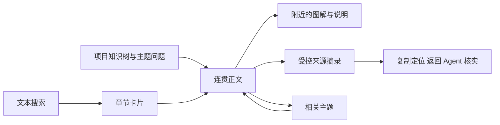

---
{
  "id": "lumine-wiki-reader",
  "title": "知识树、图解与来源阅读",
  "summary": "阅读器围绕目录、正文和来源组织项目理解；图解在浏览器按需绘制，来源观察与语义审阅独立呈现。",
  "type": "mechanism",
  "status": "current",
  "locale": "zh-CN",
  "tags": [
    "reader",
    "阅读器",
    "目录",
    "Mermaid"
  ],
  "aliases": [
    "reader",
    "阅读器",
    "目录",
    "Mermaid",
    "source reference",
    "图解",
    "serveWiki",
    "openDocument"
  ],
  "repositories": [
    "project"
  ],
  "sources": [
    {
      "id": "reader",
      "repoId": "project",
      "path": "skills/lumine-harness/src/browser/reader.ts",
      "startLine": 1,
      "endLine": 253,
      "kind": "source"
    },
    {
      "id": "reader-model",
      "repoId": "project",
      "path": "skills/lumine-harness/src/harness/wiki/reader-model.ts",
      "startLine": 1,
      "endLine": 43,
      "kind": "source"
    },
    {
      "id": "server",
      "repoId": "project",
      "path": "skills/lumine-harness/src/harness/wiki/server.ts",
      "startLine": 1,
      "endLine": 124,
      "kind": "source"
    },
    {
      "id": "files",
      "repoId": "project",
      "path": "skills/lumine-harness/src/harness/wiki/files.ts",
      "startLine": 1,
      "endLine": 203,
      "kind": "source"
    },
    {
      "id": "build",
      "repoId": "project",
      "path": "scripts/build-reader.ts",
      "startLine": 1,
      "endLine": 119,
      "kind": "source"
    },
    {
      "id": "engine",
      "repoId": "project",
      "path": "skills/lumine-harness/src/harness/wiki/engine.ts",
      "startLine": 36,
      "endLine": 81,
      "kind": "source",
      "note": "历史观察与本机核对记录分离"
    }
  ],
  "relations": [
    {
      "target": "lumine-wiki",
      "kind": "depends_on",
      "note": "正文、章节、目录和审阅由同一知识协议提供"
    },
    {
      "target": "lumine-architecture",
      "kind": "related",
      "note": "浏览器资源独立构建并自包含分发"
    }
  ],
  "watchScopes": [
    {
      "repoId": "project",
      "path": "skills/lumine-harness/src/browser/reader.ts"
    },
    {
      "repoId": "project",
      "path": "skills/lumine-harness/src/harness/wiki/reader-model.ts"
    },
    {
      "repoId": "project",
      "path": "skills/lumine-harness/src/harness/wiki/server.ts"
    },
    {
      "repoId": "project",
      "path": "skills/lumine-harness/src/harness/wiki/files.ts"
    },
    {
      "repoId": "project",
      "path": "scripts/build-reader.ts"
    }
  ],
  "diagrams": [
    {
      "id": "reading-flow",
      "title": "从目录到具体依据",
      "caption": "页面与卡片共享文本；源码按登记来源读取，浏览器不会调用模型或改写知识。",
      "sources": [
        "reader",
        "server",
        "reader-model"
      ]
    }
  ],
  "sections": [
    {
      "id": "知识树图解与来源阅读",
      "sources": []
    },
    {
      "id": "reading-navigation",
      "sources": []
    },
    {
      "id": "reader-evidence",
      "sources": [
        "engine"
      ]
    },
    {
      "id": "text-diagrams",
      "sources": []
    },
    {
      "id": "read-only-service",
      "sources": []
    },
    {
      "id": "reader-failures-and-validation",
      "sources": []
    }
  ]
}
---

# 知识树、图解与来源阅读

## 从项目问题进入机制说明

默认布局包含持续可见的知识目录、正文和本页导航。目录来自 coverage，按主题层级展示问题和页面；没有目录时仍能浏览已有正文，而不是创建固定栏目。点击页面会展开所属主题及祖先，面包屑保留阅读路径。卡片和列表用于浏览与搜索，章节命中进入对应位置，关联区能继续进入依赖、决策或相关内容。

阅读位置在当前浏览器会话的 sessionStorage 中保存，关闭图查看器恢复原滚动位置；浏览器后退和前进处理页面路由。它不是跨设备阅读同步。窄屏将目录收进可关闭的侧栏，键盘可以遍历目录、本页锚点和对话框。切换界面语言只切换控件说明，不翻译或隐藏正文。

## 来源与审阅帮助读者判断能否依赖

正文头部分别显示内容适用状态、来源上次观察和语义审阅。上次来源未变只表示已保存观察与基线一致，不等于刷新页面时重新扫描源码，也不证明解释正确。清缓存或换 clone 后，缺少匹配本机核对记录时显示尚待核对；登记来源仓库缺失时显示来源缺失，不能把复制来的旧观察当成本机已核实。历史核对时间和语义审阅仍可查看。作者核对和独立审阅分开标识；正文或来源版本变了，旧审阅不能继续显示适用。

来源按钮只读取当前文档声明的 source ID。面板提供仓库身份、相对路径、行号、文本摘录、当前文件内容指纹、知识基线指纹和读取时间。指纹针对文件内容，可以反映未提交修改；它不是已部署版本证明。缺少来源仓库时已有 Wiki 仍可读，源码面板明确不可用，不把缺失标为最新。

章节可登记自身 sources，使依据靠近相关解释。复制源码定位用于回到 Agent 继续调查；不是执行任意文件链接。Spec、Plan 与验证 Markdown 通过受控目录引用打开。没有独立文档身份的附件只提示项目相对路径，不假装已审阅附件内容。

## 图解来自文本，显示失败也能读

卡片为可选择、搜索、复制的 HTML 文本。Mermaid 源码保存在 Markdown 中，进入可见区域或用户请求预览时才绘制。浏览器会产生 SVG DOM，但不把它保存成知识真源、索引图片或模型输入；绘图不调用模型。正文说明、图名、适用状态和来源独立可读，纯文本模型可以理解关系并维护图源码。

图查看器提供缩放、平移、适合窗口、重置、稳定引用、源码复制和 Mermaid 文本导出。键盘加减键调整缩放，方向键移动，0 适合窗口，Escape 关闭。用户主动导出 SVG 时，浏览器添加标题、状态、正文版本与身份，并清除脚本、链接及远程资源引用；这是显式本地导出，不进入普通知识生产流程。

严格 Mermaid 配置禁用 HTML 标签。图规模上限为 50,000 字符和 300 条受计数边，拒绝自定义配置、click、脚本和远程地址；错误或超限显示反馈并保留源码，不绘制截断图。实际修改应拆成总览和专题，不能通过提高限制掩盖不可读的密集关系网。

## 本地服务的访问边界

`wiki serve` 只监听回环地址，HTTP 仅接受 GET／HEAD，校验 Host 和 Origin。扫描、来源与 HTTP 共用登记根、忽略规则和真实路径检查，符号链接不能绕过允许范围。静态资源限定可用扩展名和文件路径，错误响应不泄露本机绝对路径或堆栈。

Markdown 经过清洗；外部图片不自动请求，Mermaid 输出再次清洗。脚本、样式、字体与动态 chunk 由正式包本地提供，内容安全策略限制外部资源。服务不会提供写 API、后台模型聊天或独立绘图编辑器；修改正文仍回到当前 Agent 与 Wiki 更新流程。

## 遇到错误与未完成内容时怎么继续

目录显示的是写作覆盖进度，而非内容已通过语义验收。部分主题未完成、引用内容缺失、目录关系异常或某篇解析失败分别展示；可复制继续整理指令。异步请求用请求序号避免旧页面响应覆盖新导航，加载、空结果、失败和重试可见。

源码变化请执行适用扫描或让 Agent 直接核实，单纯刷新阅读器不重新解释代码。无可靠搜索结果时可换术语或从目录进入，不用无关卡片凑数。图显示失败先查看 Mermaid 文本，修复由 Agent 改源码；页面不存在“后台 AI 修复”按钮。

验证阅读器要覆盖真实目录进入章节、源码指纹对比、相关主题、返回位置、窄屏键盘以及错误图。正式分发无源码仓依赖、无缓存、断网时仍应读取既有正文并显示图解；此页描述实现与检验方法，实际浏览器验收另见 Validation，不能由静态代码推断用户已接受。
