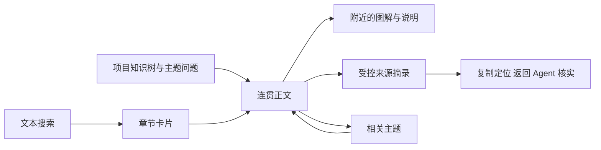

# 知识树、图解与来源阅读

## 从项目问题进入机制说明

当前阅读界面由 React TSX 入口组织首页、主题、正文与来源面板，搜索、Markdown 呈现和图解分别由组件承载；它们读取同一份 Wiki 与 coverage 文本。默认布局包含知识目录、正文和本页导航。目录按主题层级展示问题和页面；没有目录时仍能浏览已有正文，而不是创建固定栏目。点击页面会展开所属主题及祖先，面包屑保留阅读路径。卡片和列表用于浏览与搜索，章节命中进入对应位置，关联区能继续进入依赖、决策或相关内容。搜索默认只查 Wiki；主动切换到全部范围才纳入 Spec、Plan 和逐文件登记的验证材料，浏览器通过继续加载查看后续结果。

阅读位置和目录展开状态保存在当前浏览器会话的 sessionStorage，并按项目 `projectId` 隔离；关闭图查看器恢复原滚动位置，浏览器后退和前进处理页面路由。服务切到另一项目，或刷新时无法确认原项目身份，会清理上一项目的页面与对话框状态并回到首页。它不是跨设备阅读同步。窄屏将目录收进可关闭的侧栏；页面导航与后退将焦点移到主内容，章节定位聚焦对应标题，键盘仍可遍历目录、本页锚点和对话框。界面默认使用项目语言，切换语言只切换控件说明，不翻译或隐藏正文。

文件改名保留文档 ID，旧路径指向同一身份；已经登记的旧文档或旧章节映射由本地服务解析，精确章节映射优先于整篇映射。阅读器取得完整正文和当前引用，用替换当前历史项的方式规范 URL，再定位标题；后退不会额外经过一个别名页面。同页旧章节链接也进入这一解析路径。没有可靠映射的片段给出失效提示，正文与有效目录仍可阅读。正文版本未变时不重建节点，避免规范引用后的再次请求清掉章节焦点。

## 来源与审阅帮助读者判断能否依赖

正文头部分别显示内容适用状态、来源上次观察和语义审阅。上次来源未变只表示已保存观察与基线一致，不等于刷新页面时重新扫描源码，也不证明解释正确。清缓存或换 clone 后，缺少匹配本机核对记录时显示尚待核对；登记来源仓库缺失时显示来源缺失，不能把复制来的旧观察当成本机已核实。历史核对时间和语义审阅仍可查看。作者核对和独立审阅分开标识；正文或来源版本变了，旧审阅不能继续显示适用。

来源按钮只读取当前文档声明的 source ID。面板提供仓库身份、相对路径、行号、文本摘录、当前文件内容指纹、知识基线指纹和读取时间。指纹针对文件内容，可以反映未提交修改；它不是已部署版本证明。缺少来源仓库时已有 Wiki 仍可读，源码面板明确不可用，不把缺失标为最新。

章节可登记自身 sources，使依据靠近相关解释。复制源码定位用于回到 Agent 继续调查；不是执行任意文件链接。Spec、Plan 与验证 Markdown 通过受控目录引用打开。没有独立文档身份的附件只提示项目相对路径，不假装已审阅附件内容。

## 图解来自文本，显示失败也能读

卡片为可选择、搜索、复制的 HTML 文本。Mermaid 源码保存在 Markdown 中，进入可见区域或用户请求预览时才绘制。浏览器会产生 SVG DOM，但不把它保存成知识真源、索引图片或模型输入；绘图不调用模型。正文说明、图名、适用状态和来源独立可读，纯文本模型可以理解关系并维护图源码。

图查看器提供缩放、平移、适合窗口、重置、稳定引用、源码复制和 Mermaid 文本导出。键盘加减键调整缩放，方向键移动，0 适合窗口，Escape 关闭。用户主动导出 SVG 时，浏览器添加标题、状态、正文版本与身份，并清除脚本、链接及远程资源引用；这是显式本地导出，不进入普通知识生产流程。

严格 Mermaid 配置禁用 HTML 标签。图规模上限为 50,000 字符和 300 条受计数边，拒绝自定义配置、click、脚本和远程地址；错误或超限显示反馈并保留源码，不绘制截断图。实际修改应拆成总览和专题，不能通过提高限制掩盖不可读的密集关系网。

## 本地服务的访问边界

`wiki serve` 只监听回环地址，HTTP 仅接受 GET／HEAD，校验 Host 和 Origin。扫描、来源与 HTTP 共用登记根、忽略规则和真实路径检查，符号链接不能绕过允许范围。静态资源限定可用扩展名和文件路径，错误响应不泄露本机绝对路径或堆栈。

Markdown 经过清洗；外部图片不自动请求，Mermaid 输出再次清洗。`build-reader.ts` 从 React TSX 入口构建浏览器资源，将脚本、样式、动态 chunk、许可和内容清单放入本地分发包；服务端内容安全策略限制外部资源。构建会核对并保留清单登记的旧哈希 chunk、对应许可声明，先安放新资源，再原子切换稳定的 `reader.js` 入口，最后更新清单。这样旧入口已在浏览器中时仍能加载对应 chunk；历史资源会累积，回滚后已打开的新入口不能保证其按需图解继续加载。服务不会提供写 API、后台模型聊天或独立绘图编辑器；修改正文仍回到当前 Agent 与 Wiki 更新流程。

## 遇到错误与未完成内容时怎么继续

目录显示的是写作覆盖进度，而非内容已通过语义验收。部分主题未完成、引用内容缺失、目录关系异常或某篇解析失败分别展示；可复制继续整理指令。页面切换取消旧文档请求；刷新项目数据后，旧文档响应也必须匹配当前加载版本，搜索另核对请求顺序，避免旧结果覆盖新导航。跨文档加载失败时只显示当前页的错误与重试，不沿用上一篇正文；加载、空结果、失败和重试均可见。

源码变化请执行适用扫描或让 Agent 直接核实，单纯刷新阅读器不重新解释代码。无可靠搜索结果时可换术语或从目录进入，不用无关卡片凑数。浏览器存储不可用时正文和搜索仍可用，但界面偏好与阅读位置不能跨刷新保留；剪贴板拒绝时会给出提示和可手动选取的文本。图语法错误或超限时显示图解错误并保留 Mermaid 文本，修订由 Agent 改源码；图解模块或图种动态资源载入失败时，显示“重新载入阅读器”入口，服务恢复后整页重载当前引用并重新获取阅读脚本。顶栏“刷新”只重新读取项目数据，不能替代资源失效后的整页重载。页面不存在“后台 AI 修复”按钮。

验证阅读器要覆盖真实目录进入章节、源码指纹对比、相关主题、返回位置、窄屏键盘以及错误图。正式分发无源码仓依赖、无缓存、断网时仍应读取既有正文并显示图解；此页描述实现与检验方法，实际浏览器验收另见 Validation，不能由静态代码推断用户已接受。

<!-- lumine-wiki-metadata:v1
{
  "tags": [
    "reader",
    "阅读器",
    "目录",
    "Mermaid"
  ],
  "aliases": [
    "reader",
    "阅读器",
    "目录",
    "Mermaid",
    "source reference",
    "图解",
    "serveWiki",
    "openDocument"
  ],
  "repositories": [
    "project"
  ],
  "sources": [
    {
      "id": "reader",
      "repoId": "project",
      "path": "skills/lumine-harness/src/browser/reader.tsx",
      "startLine": 1,
      "endLine": 442,
      "kind": "source"
    },
    {
      "id": "reader-model",
      "repoId": "project",
      "path": "skills/lumine-harness/src/harness/wiki/reader-model.ts",
      "startLine": 1,
      "endLine": 47,
      "kind": "source"
    },
    {
      "id": "server",
      "repoId": "project",
      "path": "skills/lumine-harness/src/harness/wiki/server.ts",
      "startLine": 1,
      "endLine": 173,
      "kind": "source"
    },
    {
      "id": "files",
      "repoId": "project",
      "path": "skills/lumine-harness/src/harness/wiki/files.ts",
      "startLine": 1,
      "endLine": 203,
      "kind": "source"
    },
    {
      "id": "build",
      "repoId": "project",
      "path": "scripts/build-reader.ts",
      "startLine": 1,
      "endLine": 199,
      "kind": "source"
    },
    {
      "id": "engine",
      "repoId": "project",
      "path": "skills/lumine-harness/src/harness/wiki/engine.ts",
      "startLine": 36,
      "endLine": 130,
      "kind": "source",
      "note": "历史观察与本机核对记录分离"
    },
    {
      "id": "reader-common",
      "repoId": "project",
      "path": "skills/lumine-harness/src/browser/reader-common.ts",
      "startLine": 1,
      "endLine": 168,
      "kind": "source"
    },
    {
      "id": "reader-search",
      "repoId": "project",
      "path": "skills/lumine-harness/src/browser/reader-search.tsx",
      "startLine": 1,
      "endLine": 124,
      "kind": "source"
    },
    {
      "id": "reader-markdown",
      "repoId": "project",
      "path": "skills/lumine-harness/src/browser/reader-markdown.tsx",
      "startLine": 1,
      "endLine": 179,
      "kind": "source"
    },
    {
      "id": "reader-diagrams",
      "repoId": "project",
      "path": "skills/lumine-harness/src/browser/reader-diagrams.tsx",
      "startLine": 1,
      "endLine": 181,
      "kind": "source"
    },
    {
      "id": "reader-styles",
      "repoId": "project",
      "path": "skills/lumine-harness/src/browser/styles.css",
      "startLine": 1,
      "endLine": 282,
      "kind": "source"
    },
    {
      "id": "references",
      "repoId": "project",
      "path": "skills/lumine-harness/src/harness/wiki/references.ts",
      "startLine": 1,
      "endLine": 20,
      "kind": "source"
    },
    {
      "id": "document-operations",
      "repoId": "project",
      "path": "skills/lumine-harness/src/harness/core/document-operations.ts",
      "startLine": 107,
      "endLine": 201,
      "kind": "source"
    }
  ],
  "relations": [
    {
      "target": "lumine-wiki",
      "kind": "depends_on",
      "note": "正文、章节、目录和审阅由同一知识协议提供"
    },
    {
      "target": "lumine-architecture",
      "kind": "related",
      "note": "浏览器资源独立构建并自包含分发"
    }
  ],
  "watchScopes": [
    {
      "repoId": "project",
      "path": "skills/lumine-harness/src/browser/reader.tsx"
    },
    {
      "repoId": "project",
      "path": "skills/lumine-harness/src/browser/reader-common.ts"
    },
    {
      "repoId": "project",
      "path": "skills/lumine-harness/src/browser/reader-search.tsx"
    },
    {
      "repoId": "project",
      "path": "skills/lumine-harness/src/browser/reader-markdown.tsx"
    },
    {
      "repoId": "project",
      "path": "skills/lumine-harness/src/browser/reader-diagrams.tsx"
    },
    {
      "repoId": "project",
      "path": "skills/lumine-harness/src/browser/styles.css"
    },
    {
      "repoId": "project",
      "path": "skills/lumine-harness/src/harness/wiki/reader-model.ts"
    },
    {
      "repoId": "project",
      "path": "skills/lumine-harness/src/harness/wiki/server.ts"
    },
    {
      "repoId": "project",
      "path": "skills/lumine-harness/src/harness/wiki/files.ts"
    },
    {
      "repoId": "project",
      "path": "skills/lumine-harness/src/harness/wiki/engine.ts"
    },
    {
      "repoId": "project",
      "path": "scripts/build-reader.ts"
    },
    {
      "repoId": "project",
      "path": "skills/lumine-harness/src/harness/wiki/references.ts"
    },
    {
      "repoId": "project",
      "path": "skills/lumine-harness/src/harness/core/document-operations.ts"
    }
  ],
  "diagrams": [
    {
      "id": "reading-flow",
      "title": "从目录到具体依据",
      "caption": "页面与卡片共享文本；源码按登记来源读取，浏览器不会调用模型或改写知识。",
      "sources": [
        "reader",
        "server",
        "reader-model"
      ]
    }
  ],
  "sections": [
    {
      "id": "知识树图解与来源阅读",
      "sources": []
    },
    {
      "id": "reading-navigation",
      "sources": [
        "reader",
        "reader-model",
        "reader-search",
        "reader-styles",
        "server",
        "engine",
        "references",
        "document-operations"
      ]
    },
    {
      "id": "reader-evidence",
      "sources": [
        "reader",
        "server",
        "engine"
      ]
    },
    {
      "id": "text-diagrams",
      "sources": [
        "reader-markdown",
        "reader-diagrams"
      ]
    },
    {
      "id": "read-only-service",
      "sources": [
        "server",
        "reader-common",
        "build"
      ]
    },
    {
      "id": "reader-failures-and-validation",
      "sources": [
        "reader",
        "reader-search",
        "reader-markdown",
        "reader-diagrams",
        "reader-common"
      ]
    }
  ]
}
-->
