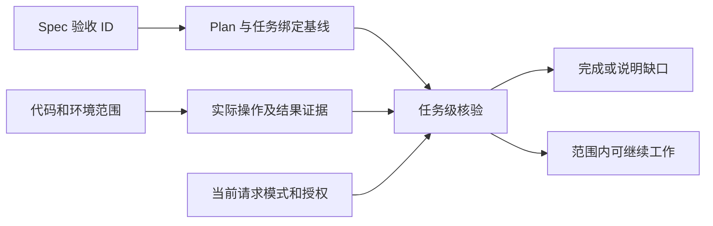

# 任务检查、停止状态与继续条件

## “完成”先对应当前请求

用户只要求讨论产品方案时，完成表示讨论产物已交付；用户要求诊断时，完成表示已核实问题并说明影响。实施完成还需要适用验收与实际执行证据。部署、浏览器验收与宿主行为不会因代码检查退出码为零自动通过。

`.lumine/tasks/` 保存任务模式、Spec/Plan 引用、验收基线、证据与相关知识。`.lumine/local/runtime/` 保存本机会话与探针状态。文档身份与文件名分开，改成中文文件名不应改变任务身份。

## 六种公共状态

| 状态 | 含义 |
|---|---|
| done | 当前请求范围已收口 |
| continue_autonomously | 下一步明确且已获授权 |
| needs_user_decision | 存在不能代替用户决定的重要取舍 |
| needs_credentials | 缺少必要登录或凭据 |
| needs_manual_app_step | 需要用户在应用内完成操作 |
| blocked_external | 外部依赖不可用且没有安全替代 |

状态含义由公共 Core 管理；Adapter 只转换协议。自动继续还受进度、会话隔离、重复事件和链长限制约束，不能靠重复写同一状态无限触发。

## 内容变化怎样影响任务

验收有稳定 ID，任务引用适用条目及内容基线。不同 Plan 可以只绑定同一 Spec 中自己承担的验收。内容指纹发现变化后，Agent 判断其语义影响；指纹不是批准记录，也不能用改写 Plan 自行取得改变产品承诺的授权。

有效证据记录操作、结果、观察时间、证据文件指纹、代码与环境范围。历史结果不能自动证明新代码通过；在文档中写一个“通过”不构成操作证据。最新失败也不能被早期成功掩盖。

## 检查和语义判断的边界

Runtime 检查身份、链接、状态和证据关联，方案覆盖与真实语义仍需要 Agent 核实。`check health` 是显式全项目结构检查；它不应成为所有任务收尾前强制全量修复的入口。仅诊断失败时，报告已执行操作、问题、影响与未覆盖范围即可完成当前诊断，不会自动授权修改实现。
