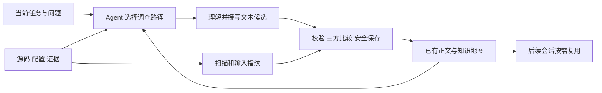
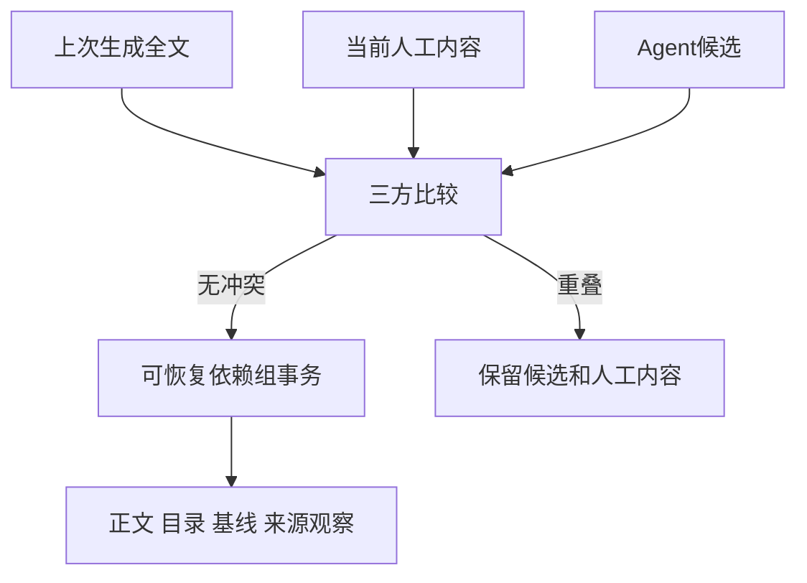

---
{
  "id": "lumine-wiki",
  "title": "Wiki 扫描、检索、增量更新与阅读",
  "summary": "Agent 决定读什么和写什么；知识地图、章节检索、来源观察与可恢复三方合并把认识安全沉淀为项目资产。",
  "type": "mechanism",
  "status": "current",
  "locale": "zh-CN",
  "tags": [
    "repo wiki",
    "knowledge",
    "知识库",
    "Agentic Search"
  ],
  "aliases": [
    "repo wiki",
    "knowledge",
    "知识库",
    "Agentic Search",
    "检索",
    "threeWayMerge",
    "prepareUpdate",
    "coverage"
  ],
  "repositories": [
    "project"
  ],
  "sources": [
    {
      "id": "engine",
      "repoId": "project",
      "path": "skills/lumine-harness/src/harness/wiki/engine.ts",
      "startLine": 1,
      "endLine": 356,
      "kind": "source"
    },
    {
      "id": "files",
      "repoId": "project",
      "path": "skills/lumine-harness/src/harness/wiki/files.ts",
      "startLine": 1,
      "endLine": 203,
      "kind": "source"
    },
    {
      "id": "merge",
      "repoId": "project",
      "path": "skills/lumine-harness/src/harness/wiki/merge.ts",
      "startLine": 1,
      "endLine": 41,
      "kind": "source"
    },
    {
      "id": "documents",
      "repoId": "project",
      "path": "skills/lumine-harness/src/harness/wiki/documents.ts",
      "startLine": 1,
      "endLine": 139,
      "kind": "source"
    },
    {
      "id": "sections",
      "repoId": "project",
      "path": "skills/lumine-harness/src/harness/wiki/sections.ts",
      "startLine": 1,
      "endLine": 32,
      "kind": "source"
    },
    {
      "id": "coverage",
      "repoId": "project",
      "path": "skills/lumine-harness/src/harness/wiki/coverage.ts",
      "startLine": 1,
      "endLine": 42,
      "kind": "source"
    },
    {
      "id": "search",
      "repoId": "project",
      "path": "skills/lumine-harness/src/harness/wiki/search.ts",
      "startLine": 1,
      "endLine": 103,
      "kind": "source"
    },
    {
      "id": "transactions",
      "repoId": "project",
      "path": "skills/lumine-harness/src/harness/wiki/transactions.ts",
      "startLine": 1,
      "endLine": 63,
      "kind": "source"
    },
    {
      "id": "skill",
      "repoId": "project",
      "path": "skills/lumine-harness/assets/skills/lumine-knowledge/SKILL.md",
      "startLine": 1,
      "endLine": 24,
      "kind": "source"
    }
  ],
  "relations": [
    {
      "target": "lumine-architecture",
      "kind": "related",
      "note": "知识生产与工具构建的职责"
    },
    {
      "target": "lumine-wiki-reader",
      "kind": "related",
      "note": "同一文本的浏览器阅读"
    },
    {
      "target": "lumine-adoption",
      "kind": "related",
      "note": "格式转换保留当前正文与真实基线"
    },
    {
      "target": "lumine-workflow",
      "kind": "related",
      "note": "知识与任务产物的权威分工"
    }
  ],
  "watchScopes": [
    {
      "repoId": "project",
      "path": "skills/lumine-harness/src/harness/wiki/engine.ts"
    },
    {
      "repoId": "project",
      "path": "skills/lumine-harness/src/harness/wiki/files.ts"
    },
    {
      "repoId": "project",
      "path": "skills/lumine-harness/src/harness/wiki/merge.ts"
    },
    {
      "repoId": "project",
      "path": "skills/lumine-harness/src/harness/wiki/documents.ts"
    },
    {
      "repoId": "project",
      "path": "skills/lumine-harness/src/harness/wiki/sections.ts"
    },
    {
      "repoId": "project",
      "path": "skills/lumine-harness/src/harness/wiki/coverage.ts"
    },
    {
      "repoId": "project",
      "path": "skills/lumine-harness/src/harness/wiki/search.ts"
    },
    {
      "repoId": "project",
      "path": "skills/lumine-harness/src/harness/wiki/transactions.ts"
    },
    {
      "repoId": "project",
      "path": "skills/lumine-harness/assets/skills/lumine-knowledge/SKILL.md"
    }
  ],
  "diagrams": [
    {
      "id": "knowledge",
      "title": "调查所得进入持久知识",
      "caption": "写正文与判断影响由Agent完成；扫描只提供线索，工具负责输入检查和安全保存。",
      "sources": [
        "engine",
        "skill",
        "files"
      ]
    },
    {
      "id": "merge",
      "title": "生成基线、人工内容与候选的三方比较",
      "caption": "生成基线保留真实全文。正文、基线、目录等依赖组通过事务一起生效；冲突不作为成功。",
      "sources": [
        "engine",
        "merge",
        "transactions"
      ]
    }
  ]
}
---

# Wiki 扫描、检索、增量更新与阅读

## 什么真正产生知识

Agent 根据问题选择 Wiki、源码或组合，理解入口、调用链、约束与异常，再撰写正文和 Mermaid。`wiki scan` 只发现来源变化；`wiki update` 接收已经写好的文本，没有独立模型生成过程。没有活动 Agent 时只能登记待处理线索，不能把来源扫描完成显示为知识更新完成。

重要缺口、过期或矛盾应在核实后形成相关知识增量；显式只读请求不写文件，没有新认识的小修可以零更新。检索不到已有内容时先考虑别名、关键词或结构，不立即复制另一篇。Wiki 保留现状，Spec 维护目标，Plan 保留本次技术变化，运行证据仍在 Validation。

## 一份目录，多种阅读粒度

`.lumine/wiki-state/coverage.json` 是主题层级唯一来源，topic 的 parentId 表达归属、数组表示同级顺序，问题和来源范围说明覆盖目标。planned／partial／covered／deferred 描述内容推进，deferred 需要理由。程序能检查引用和循环，不能判定“这个专题解释得足够深入”。页面只有一个主要位置，其他关联用有类型的 related／depends_on／decision；父子关系由目录派生。

Markdown 页面是三方合并主要单位。重要章节在标题前用 `` 固定身份，标题和文件改名不应改变该 ID。parser 识别代码围栏外的 H1—H6，记录层级、范围及可选来源关联。`show 文档ID#片段ID` 展开章节或图解，片段不存在返回错误，不静默退回全文；图 ID 与章节 ID 不能碰撞。章节没有独立审批状态机。

## 检索怎样选择文本，什么时候不足

本地词项检索结合中文分词、英文词项、代码标识符拆分和常用双语别名。标题、章节、正文、来源和图解文字参与排名，稀有词与命中覆盖影响得分，常见问句词被过滤。结果包含稳定引用、片段、命中原因、来源与时效；默认最多六条并受总字符预算限制，少于上限不补齐。

这不是任意跨语言语义检索。问法与术语不一致时，当前模型可重述查询或直接看目录／源码。片段不能代替完整限定条件，修改前按需要 show 展开。代码位置已知时直接读文件合理，不要求为了合规多调用一次 query。

查询读取已保存正文与状态，不逐页扫描源码。正文索引和导航可从持久文本重建，缺少缓存不需要重新调用模型。持久的核对时间与来源指纹描述历史观察；本机还通过 `.lumine/local/wiki/observation-receipts.json` 确认该观察适用于当前真实项目根、登记仓库根与配置。清缓存或换 clone 后，无匹配记录时显示尚待核对；登记仓库根缺失时直接显示来源缺失，已有正文和历史语义审阅继续保留。

查询只核对根存在、身份及本机记录，不哈希或遍历整仓源码。显式 scan、成功应用候选或语义核实会重新检查适用来源并建立本机记录；缓存写入失败不回滚已经可靠保存的正文，只使后续读取继续保持未知。即使本机记录存在，时效仍指上次观察，当前任务的关键行为应按需要核实源码。

## 来源未变不等于解释正确

精确 sources 给出结论依据，watchScopes 发现新增、删除、改名及未提交变化；扫描按仓库和重叠范围复用快照。仓库 ID 与相对路径通过登记根解析，忽略私有文件、Runtime 副本、备份和候选，真实路径不能越界。源码只能证明当前开发实现，不能证明已部署或外部服务运行。

source observation 记录 checkedAt 与来源指纹；semantic review 另记正文 revision、来源指纹、范围、发现、限制、作者或独立 reviewer。旧版本审阅变为 outdated；未审阅不能因来源一致自动显示已核实。仅审阅可保存记录而不重写正文。结构检查的 notVerified 明确保留语义、运行和人类接受边界。

## 新建、拆页和更新怎么保存

prepare 工作包绑定配置、来源、当前正文和生成基线。新页要求路径预期不存在，避免覆盖同期创建；更新比较上次生成全文、当前含人工编辑的正文和新候选。无基线页面先按人工资产保护。新增来源或监控范围要在准备清单中声明，不能生成后偷偷扩大来源集合。

含目录或引用移动的变更组一起处理。例如拆页同时修改总览、创建子页、更新 coverage 与旧引用映射；不能子页已出现而目录仍指向被删章节。应用前重新核对源码与配置，漂移则保留候选并重新评估。事务保存 before／after，读者在未完成组期间读取上一个完整版本；恢复接受预期旧值或本次输出，第三种修改保留冲突。各独立组分别报告，不把部分完成当全部完成。

## 什么能清理，怎样验证

`.lumine/wiki-state/` 的真实基线、目录、审阅、候选、人工决定和事务是项目资产，适合共享的内容纳入 Git。`.lumine/local/wiki/` 仅放可重建缓存和本机运行态；重新让模型写一遍不是无损恢复。不要删除正在运行的锁或唯一恢复材料。

修改维护工具应覆盖人工改文与改图、重叠冲突、并发新建、生成期间源码漂移、同组中断与恢复、错误引用和新文件漏扫。检索应用中文、英文、代码符号、模糊问法及明确无答案测试；更重要的是未参与建库的 Agent 能否据此正确回答、定位实现并维护新知识。程序通过不能单独证明内容质量。
