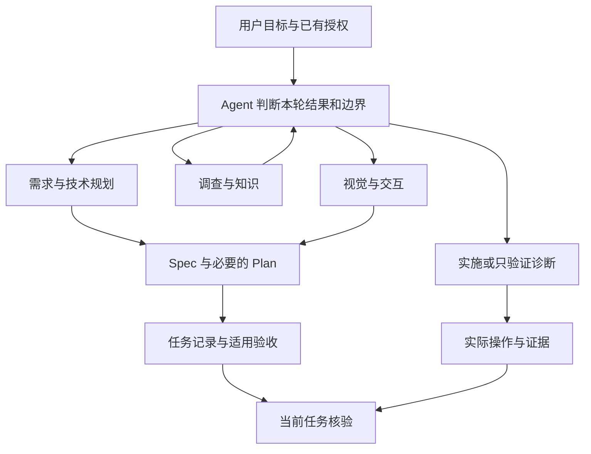
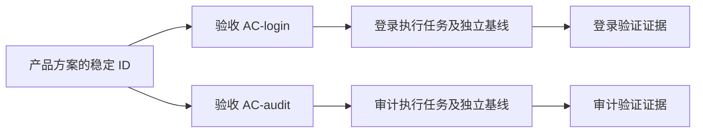

---
{
  "id": "lumine-workflow",
  "title": "四个 Skill、产品方案与任务证据",
  "summary": "按目标组合四种能力，Spec 维护产品承诺，Plan 维护本次技术实施，任务记录将适用验收和实际证据绑定到当前会话。",
  "type": "mechanism",
  "status": "current",
  "locale": "zh-CN",
  "tags": [
    "工作流",
    "产品方案",
    "执行计划",
    "四个Skill",
    "任务证据",
    "product spec",
    "exec plan",
    "acceptance",
    "task mode"
  ],
  "aliases": [
    "工作流",
    "产品方案",
    "执行计划",
    "四个Skill",
    "任务证据",
    "product spec",
    "exec plan",
    "acceptance",
    "task mode"
  ],
  "repositories": [
    "project"
  ],
  "sources": [
    {
      "id": "plan-skill",
      "repoId": "project",
      "path": "skills/lumine-harness/assets/skills/lumine-plan/SKILL.md",
      "startLine": 6,
      "endLine": 24,
      "kind": "source"
    },
    {
      "id": "run-skill",
      "repoId": "project",
      "path": "skills/lumine-harness/assets/skills/lumine-run/SKILL.md",
      "startLine": 6,
      "endLine": 26,
      "kind": "source"
    },
    {
      "id": "knowledge-skill",
      "repoId": "project",
      "path": "skills/lumine-harness/assets/skills/lumine-knowledge/SKILL.md",
      "startLine": 6,
      "endLine": 24,
      "kind": "source"
    },
    {
      "id": "design-skill",
      "repoId": "project",
      "path": "skills/lumine-harness/assets/skills/lumine-design/SKILL.md",
      "startLine": 6,
      "endLine": 24,
      "kind": "source"
    },
    {
      "id": "routing",
      "repoId": "project",
      "path": "skills/lumine-harness/src/harness/core/phase-router.ts",
      "startLine": 16,
      "endLine": 67,
      "kind": "source"
    },
    {
      "id": "skill-read",
      "repoId": "project",
      "path": "skills/lumine-harness/src/harness/core/phase-router.ts",
      "startLine": 78,
      "endLine": 151,
      "kind": "source"
    },
    {
      "id": "doc-identity",
      "repoId": "project",
      "path": "skills/lumine-harness/src/harness/core/documents.ts",
      "startLine": 31,
      "endLine": 98,
      "kind": "source"
    },
    {
      "id": "acceptance",
      "repoId": "project",
      "path": "skills/lumine-harness/src/harness/core/documents.ts",
      "startLine": 100,
      "endLine": 165,
      "kind": "source"
    },
    {
      "id": "task-storage",
      "repoId": "project",
      "path": "skills/lumine-harness/src/harness/core/task-contract.ts",
      "startLine": 10,
      "endLine": 85,
      "kind": "source"
    },
    {
      "id": "task-evidence",
      "repoId": "project",
      "path": "skills/lumine-harness/src/harness/core/task-contract.ts",
      "startLine": 87,
      "endLine": 170,
      "kind": "source"
    },
    {
      "id": "task-cli",
      "repoId": "project",
      "path": "skills/lumine-harness/src/harness/core/task-cli.ts",
      "startLine": 12,
      "endLine": 34,
      "kind": "source"
    },
    {
      "id": "session-guidance",
      "repoId": "project",
      "path": "skills/lumine-harness/src/harness/core/session-context.ts",
      "startLine": 20,
      "endLine": 58,
      "kind": "source"
    },
    {
      "id": "stage-handoff",
      "repoId": "project",
      "path": "skills/lumine-harness/assets/skills/lumine-plan/references/stage-handoff.md",
      "kind": "source"
    }
  ],
  "relations": [
    {
      "target": "lumine-architecture",
      "kind": "related",
      "note": "理解 Skill、Core 与分发职责"
    },
    {
      "target": "lumine-root-config",
      "kind": "depends_on",
      "note": "文档和证据依赖项目及仓库身份"
    },
    {
      "target": "lumine-task-check",
      "kind": "related",
      "note": "结束请求如何读取任务证据"
    },
    {
      "target": "lumine-wiki",
      "kind": "related",
      "note": "稳定实现结论如何沉淀为可检索知识"
    }
  ],
  "diagrams": [
    {
      "id": "intent-to-evidence",
      "title": "从用户目标到当前任务证据",
      "caption": "能力按问题组合；下方身份和证据是可恢复记录。本图不表示阶段授权，正式产品工作的阶段交接以适用指导和人的确认为准。",
      "sources": [
        "routing",
        "plan-skill",
        "run-skill",
        "task-storage",
        "task-evidence"
      ]
    },
    {
      "id": "task-acceptance-links",
      "title": "一个产品方案服务多个执行计划",
      "caption": "任务只绑定承担的验收项。验收内容变化通过独立基线影响引用者，不以整份 Spec 文件哈希使所有计划一齐失效。",
      "sources": [
        "acceptance",
        "task-storage",
        "task-evidence"
      ]
    }
  ],
  "sections": [
    {
      "id": "workflow-answer",
      "sources": [
        "plan-skill",
        "run-skill",
        "knowledge-skill",
        "design-skill",
        "stage-handoff"
      ]
    },
    {
      "id": "workflow-routing",
      "sources": [
        "routing",
        "skill-read"
      ]
    },
    {
      "id": "workflow-docs",
      "sources": [
        "plan-skill",
        "run-skill",
        "design-skill"
      ]
    },
    {
      "id": "workflow-identity",
      "sources": [
        "doc-identity",
        "acceptance"
      ]
    },
    {
      "id": "workflow-record",
      "sources": [
        "task-storage",
        "task-cli"
      ]
    },
    {
      "id": "workflow-evidence",
      "sources": [
        "task-evidence"
      ]
    },
    {
      "id": "workflow-resume",
      "sources": [
        "session-guidance",
        "task-storage",
        "stage-handoff"
      ]
    },
    {
      "id": "workflow-quality",
      "sources": [
        "run-skill",
        "knowledge-skill"
      ]
    }
  ],
  "watchScopes": [
    {
      "repoId": "project",
      "path": "skills/lumine-harness/assets/skills/lumine-plan/SKILL.md"
    },
    {
      "repoId": "project",
      "path": "skills/lumine-harness/assets/skills/lumine-run/SKILL.md"
    },
    {
      "repoId": "project",
      "path": "skills/lumine-harness/assets/skills/lumine-knowledge/SKILL.md"
    },
    {
      "repoId": "project",
      "path": "skills/lumine-harness/assets/skills/lumine-design/SKILL.md"
    },
    {
      "repoId": "project",
      "path": "skills/lumine-harness/src/harness/core/phase-router.ts"
    },
    {
      "repoId": "project",
      "path": "skills/lumine-harness/src/harness/core/documents.ts"
    },
    {
      "repoId": "project",
      "path": "skills/lumine-harness/src/harness/core/task-contract.ts"
    },
    {
      "repoId": "project",
      "path": "skills/lumine-harness/src/harness/core/task-cli.ts"
    },
    {
      "repoId": "project",
      "path": "skills/lumine-harness/src/harness/core/session-context.ts"
    }
  ]
}
---

# 四个 Skill、产品方案与任务证据

## Skill 是能力入口，不是四道手续

用户的目标可能是讨论一个产品行为、实现已批准功能、核实故障，或者解释某个架构。Lumine 用四个日常 Skill 提供相应判断方法，用户不需要先学会调度它们。`lumine-plan` 同时覆盖产品规划和技术规划；`lumine-run` 同时覆盖实施、恢复、验证和诊断；`lumine-knowledge` 负责调查与工程知识；`lumine-design` 负责具体视觉和交互取舍。

例如“比较两种迁移方式”属于技术规划，即使说了“设计”，也不自动进入视觉设计；“核实为什么登录失败”可以仅诊断，即使发现可修复问题，也不能把诊断授权扩大为修改登录实现。产品功能按 Spec →（必要设计 → 补充同一 Spec）→ Exec Plan → Run 推进，每次跨阶段由用户确认具体成果和下一步；阶段内自主推进。早期“把功能做出来”不代替尚未展示成果的确认。用户问“是否可以进入下一步”时，Agent 读取适用规则与实际成果，判断是否需要设计及交接缺口，给出建议后等待对应确认。

这是能力与证据关系图，不表示阶段授权。设计确认后回写同一 Spec，补充 Spec 经确认后编写 Exec Plan，Plan 经确认后进入 Run；无需设计时由已确认 Spec 进入 Exec Plan。Run 中及之后的范围内验证无需另设确认。详细交接方法以 [阶段判断与交接](../../skills/lumine-harness/assets/skills/lumine-plan/references/stage-handoff.md) 为准。

图中 `K → A` 表示知识帮助理解，不是知识决定授权。对位置明确的小修，Agent 可以直接核实源码；对跨模块问题，Wiki 的目录、专题和章节更有价值。

## 自然语言候选怎样变成实际选择

`phase-router` 用中英文模式给出候选，但候选不会直接修改任务模式或建立门禁。明确的 `$lumine-run`、带调用动词的 Skill 名称，或任务中的 `selectedSkills` 才进入已选择能力集合。单纯在比较说明中提到 Skill 名称，不等于调用。

支持工具前后事件的 Adapter 可以要求先读取已经选择的规范 Skill，然后才允许识别为修改的工具。读取记录绑定文件内容哈希：同一版本已读可复用，更新后的规范必须重新核对。没有实际选择的能力不会因为关键词出现就强迫读取。未知名称记录为诊断信息，不能污染后续有效任务绑定。

任务绑定中的 `selectedSkills` 是 Agent 声明已选择的能力，`read` 则是宿主事件是否观察到对应版本被读，不能互相替代。每项还记录 `readObservability`：`tool_events` 表示 Adapter 有工具事件通道，`not_observable` 表示当前协议不能观察读取。Codex 目前只有会话开始和停止入口，因此实际读过文件仍可能显示 `read: false`；完成检查不会为此要求伪造读取事件，而是继续检查本任务的有效证据。

这层工具分类是根据宿主事件和工具名进行的检查，Shell 类工具也列入可能修改的范围。它不是通用代码沙箱，更不等于用户授权校验器；宿主未提供工具事件时，也不能宣称已经观察到规范全文被读。

## 一条信息只有一个完整维护位置

| 读者的问题 | 完整答案在哪里 | 不应在这里重复什么 |
|---|---|---|
| 用户为什么需要它，成功是什么 | Product Spec：问题、场景、业务规则、范围、验收 | 逐步执行日志和实现任务清单 |
| 本次具体怎样改变系统 | Exec Plan：技术取舍、实现顺序、当前进度、验证和恢复 | 整份产品正文 |
| 当前系统实际上怎样工作 | Repo Wiki：机制、关系、限制、来源 | 尚未落地方案冒充现状 |
| 什么操作真的执行过，适用于哪版实现 | Validation：操作、环境、时间、结果、证据 | 仅有“通过”的结论自述 |

Spec 可包含影响产品选择的技术约束、接口行为和数据要求，详细架构与迁移路径归 Plan。设计附件解决具体呈现选择，产品承诺仍归 Spec。只讨论产品时，Spec 应能单独阅读，不为凑流程创建空 Plan。

局部修复也不是按文件数量判断。只有不新增产品决策、不改变既定行为契约、无需独立跨任务协调时，才可以省略长期 Spec／Plan；目标、修改边界和验证仍要清楚。一个权限判断只改一行，也可能需要正式方案。

## 标题、文件名、验收身份分别管理

文档使用稳定 `id`，人类看到的中文标题与中文文件名可以变化。验收使用 `AC-...` 标识，任务保存它的 Spec ID、验收 ID 和内容基线。当前解析器识别形如 `## AC-login：登录后进入工作台` 的标题，正文标题语言不影响身份。

验收基线折叠普通正文的空白差异，并把能解析的文档链接归一到稳定身份；代码块保持原样。这样，普通排版或路径变化不应成为“产品要求已改变”的证据。但基线仍是内容检测，不理解人的语义。验收表达发生变化时，Agent 需要判断影响，不能把改哈希等同用户重新批准，也不能把重新记录基线等同批准。

若只改变 `AC-login`，只应使引用它的任务基线需要重新判断。计划文件名变成中文不应改变上述关系。具体改名和归档使用文档操作机制，并保持身份与引用。

## 任务记录连接人类方案与可检查事实

`.lumine/tasks/<taskId>.json` 保存当前目标、范围、模式、Spec／Plan 引用、已选择能力、适用验收、证据和必要的知识同步状态。模式是 `plan`、`implement`、`verify` 或 `diagnose`，不是从 Skill 名称推断。

任务与本机会话分开保存：任务是项目资产；会话只记录当前宿主、用户轮次以及绑定了哪个任务。`task bind` 将任务模式和本轮关联写入会话，不产生新的实施授权。恢复时先 `task show` 核对目标、边界和已存进度，再按用户本轮请求绑定，避免把上次“只诊断”或另一项实施任务沿用到新目标。

更新已存在的任务需提供它的当前内容哈希；写入在任务锁内核对，然后临时文件原子替换。外部编辑或另一 worker 已改变任务时会拒绝覆盖。中断后保留锁意味着先调查进程及文件，再恢复，不应通过盲删状态重置已发生的工作。

常用读取入口是 `task show <taskId>`、`task acceptance <specId>` 和 `task check <taskId>`。为机器写入的 JSON 不是另一份产品方案，其字段只负责身份和核验关联；Plan 仍应以人能理解的方式说明现在做到哪一步。

## 证据究竟检查什么

每条证据保存实际操作或命令、环境、观察时间、结果、证据文件及其哈希，并附适用源码的 `repoId + path + sha256`。涉及验收时还要同时附 Spec ID 与 AC ID。检查会拒绝不存在或改变的证据文件、未来时间、缺失的环境说明、未登记仓库、改变的代码基线，以及其他任务的验收证据。

相同验收、操作和环境以最新证据为准，较新的失败不会被早先成功掩盖。实施完成要求适用验收有当前通过的证据；直接小修没有 AC 时也需要适用的验证结果。若任务明确承担知识同步，相关引用和同步状态也是收口范围；无关 Wiki 页面过期不自动扩大为本任务修复工作。

检查能够证明“这些文件和关联在所记录基线上自洽”。它不能仅凭一段命令字符串证明命令真的执行过，也不能理解某份截图、日志或测试是否足够覆盖真实业务。Agent 或独立 reviewer 仍要核对原始输出和验收语义。真实宿主、浏览器运行、部署及人类接受应分别报告。

## 恢复工作时哪些能保留，哪些要重判

稳定文档、任务及证据可随 Git 和工作树恢复；本机会话状态不能代替它们。新用户轮次会使旧报告和任务绑定失去“本轮直接可用”的资格，但不会删除项目中的任务记录或用户先前明确授权。Agent 应重新核对本轮目标，然后恢复仍然有效的范围和进度，不应机械重问已明确决定。恢复的是已经确认的成果及其下一阶段，不把某阶段授权扩展到未确认的后续阶段。

只有当前任务进入实施完成判断时才检查它的实施证据。讨论完成不要求代码已写完，诊断完成可以包含失败结论。反之，不能用 `verify` 模式为本应交付实现的请求绕过验收；模式选择本身仍受真实请求约束。

## 使用这套流程时的质量判断

读 Spec 应能解释目标、正常与失败场景；读 Plan 应能找到当前结果、下一步及技术理由；读证据应分清已执行操作与建议动作。没有这些信息，文件结构通过也不足以交付。

任务实施后，已核实且可复用的现状知识按授权写回 Wiki，临时排错日志留在验证记录或执行历史。没有稳定增量可以零更新；只读查询不自动开启全量改写。这里的语义责任由四个 Skill 承担，Runtime 只维护可确定的约束，因此不需要再复制一份完整检查规则作为第五个日常 Skill。
