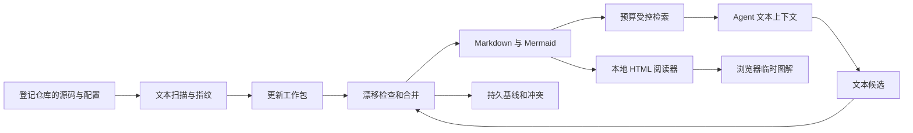
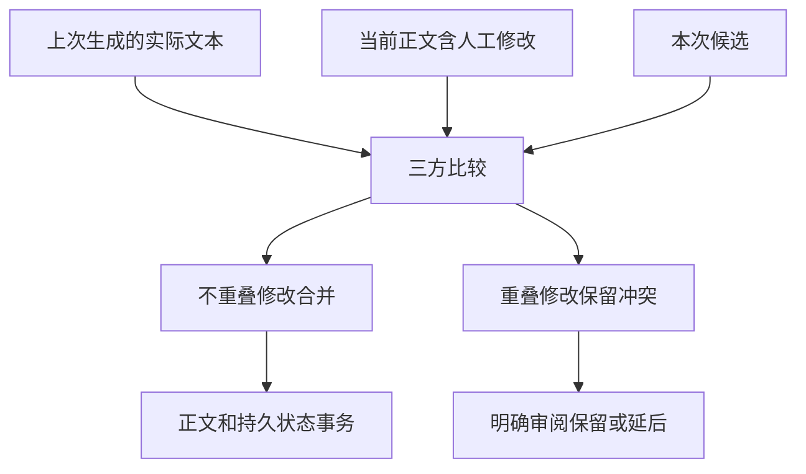

# Wiki 扫描、检索、增量更新与阅读

## 卡片和正文只有一份知识

正文保存在 `docs/repo-wiki/`，标题、摘要、来源、关系和图解身份是文本元数据。Agent 查询得到最多六张默认文本卡片，按预算进一步展开。中文词组、英文关键词和代码标识符参与检索；别名能够连接常用双语问法，但这不是任意语言的自动语义翻译。

HTML 阅读器显示目录、可选择复制的卡片、Markdown 正文、来源和相关主题。Spec 与 Plan 可以在同一阅读器打开。Mermaid 代码块在浏览器即时绘制为 SVG DOM，不落盘为知识图片，也不调用图像模型。

## 扫描为什么同时看引用和范围

精确引用回答“这句话根据什么”；监控范围发现原引用没有覆盖的新文件、删除、改名和未提交修改。来源使用仓库 ID 和相对路径，避免把父仓与子仓混成一套路径。Git 分支切换后重新核对内容；源码存在不能证明部署事实。

来源解析使用登记根、真实路径和忽略规则。符号链接不能越过允许边界，私有忽略文件不进入扫描。Runtime 副本、迁移备份和语义候选不作为知识来源，规范 TypeScript 仍可作为源仓事实。

## 三方比较保护什么

`.lumine/wiki-state/` 保存上次生成全文、来源快照、候选、人工决定、冲突和事务状态；这些是版本管理资产。`.lumine/local/wiki/` 只保存可重建的文本索引和本机状态。没有缓存时，已有知识仍能阅读、检索和绘图；重新调用模型不属于无损重建。

更新分为 prepare 和 apply。工作包锁定当前来源、配置和正文基线，应用时再次核对。漂移时保留候选并报告，不把旧内容标为最新。没有基线的已有文档按人工内容保护；审阅同一正文并建立基线后才进入正常更新。单个知识单元失败不会被整批成功掩盖。

## 只读服务与图解失败

服务只绑定回环地址，校验 Host/Origin，拒绝写方法。Markdown 清洗和严格 Mermaid 限制脚本、外部资源与超大图。图语法错误时保留源码和文字，不妨碍其他知识阅读。用户主动导出 SVG 是浏览器操作，不回写知识真源；默认复制的是 Markdown 或 Mermaid 文本。

图解表达的是正文当前标记的实现或拟议方案，图能绘制不代表关系已核实。检索无答案、来源缺失、过期或矛盾时应回到适用源码，不启动未经请求的全量改写。
