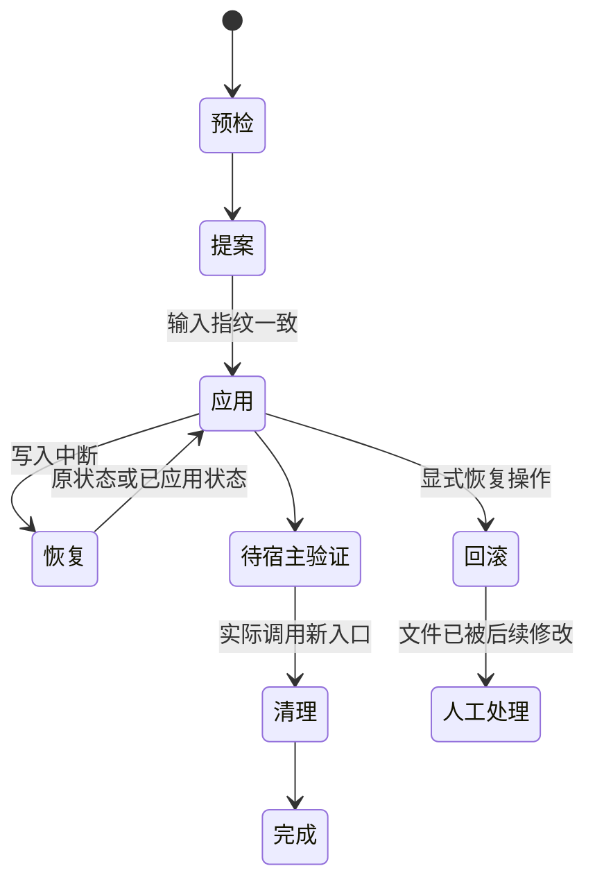

# 首次采用、升级与迁移恢复

## 提案先固定什么

采用或升级先检查项目身份、仓库边界、现有配置与受管理文件。语言按显式选择、项目配置、非交互英文默认的顺序确定。提案包括创建、替换、保留、冲突和删除操作，以及来源和目标指纹；应用阶段不重新猜语言或静默重算提案。

新项目的日常 Runtime 只认识当前协议。旧格式转换逻辑在独立 `migration/` 包中，由维护入口调用。转换器保留有效范围、授权依据、进度和证据身份，清除失效的旧技能读取及阶段等待状态。它不会修改聊天历史，也不会把未知批准补写为已批准。

## 为什么备份在 Runtime 之外

恢复资料位于项目的 `.lumine-migrations/`，由忽略规则保护，权限限制为本机使用。这样 Runtime 被替换或旧目录被清理后，恢复入口和唯一备份仍在。迁移器逐项检查目标是否等于提案旧内容或本次输出；第三种状态表示外部修改，不直接覆盖。

私有目录、worktree、符号链接与未分类内容受到保护，并阻止自动清理；明确迁移时分别核验身份和文件内容。普通 Runtime 文件才进入自动备份清理，且只删除已确认、已备份而未变化的文件。回滚同样不会覆盖用户在迁移之后写入的内容。

## 升级保护和真实宿主边界

Wiki 正文、持久状态、任务记录和项目检查扩展是项目资产，不能按 Runtime 文件淘汰规则清理。模板或技能存在人工修改时，维护工具给出保留或冲突，由明确的合并内容进入新提案。

旧宿主可能缓存旧 Hook 路径，因此迁移期间可以保留短转发入口。宿主刷新并产生新入口调用证据后才清理它们。没有宿主证据时状态仍为待验证；迁移不承诺跨仓原子完成。

## 修改时注意

恢复操作的幂等性、删除后续跑、回滚冲突和选定语言必须同时验证。改变受管文件策略要检查项目资产排除范围；只检查新目录出现会漏掉旧入口仍活跃的问题。源码测试覆盖逻辑故障注入，但真实宿主是否已切换仍需当前会话证据。
