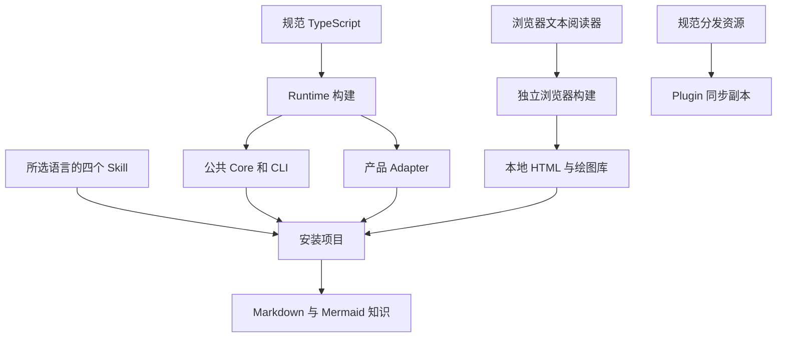

# Core、Skill、Adapter 与构建分发

## 一次修改怎样进入项目

规范源码位于 `skills/lumine-harness/src/`。维护者修改 TypeScript 后运行 `pnpm runtime:build`，构建程序把服务端文件编译为 Node 18 可运行的 `.mjs`，把阅读器及其 Markdown、Mermaid 和安全清洗依赖打包为本地静态资源。项目安装只复制正式运行资源，不需要维护仓的依赖目录。

四个日常 Skill 是语义指导：需求与方案规划、实施与验证、知识维护、视觉与交互设计。它们引用同一 Runtime，不各自复制检查规则。规范中文资源在 `assets/skills/`，英文资源使用 `.template` 扩展，安装时只选择一种语言成为可发现的 `SKILL.md`。

## Core 和宿主各管什么

Core 记录显式任务模式，核对已选择 Skill 的读取状态、检查证据和六种工作状态。关键词只提供候选能力，不能决定授权或建立硬门禁。Adapter 接收宿主事件，规范化输入，把 Core 决策转换成该宿主支持的协议。宿主是否执行 Hook、能否自动续跑，是另一个需要实际观测的层次；配置已安装不能证明宿主已经读取。

路由会考虑用户目标和已有上下文。技能名称不能替代实施授权，中文“设计”也可能是技术规划。规划、实施、仅验证和诊断均可调用知识检索，不是互斥阶段。

## 为什么单独构建阅读器

Mermaid 的绘图运行在浏览器，服务端只负责文件和文本 API。YAML 与忽略规则解析被打包为服务端 vendor，避免把 Node 版本要求较高的浏览器依赖带入 Node 18 服务端。Reader 的动态 chunk、样式和许可一并纳入清单；静态资源完整性与 Runtime 源码一致性分别检查。

Plugin wrapper 来自同步脚本，是同一规范包的副本。修改副本会在同步时丢失，也可能使两种安装形式行为不同，因此修改入口始终是规范资源。

## 边界与核实入口

本图描述源码职责和构建结构，不描述已发布版本、宿主实测状态或业务部署。阅读器构建成功不能证明所有图都可读；还需要浏览器验收。查看 `build-runtime.ts` 的产物映射、`build-reader.ts` 的 bundle 清单以及 `sync-plugin-wrapper.sh` 的复制范围可复核生成关系。
