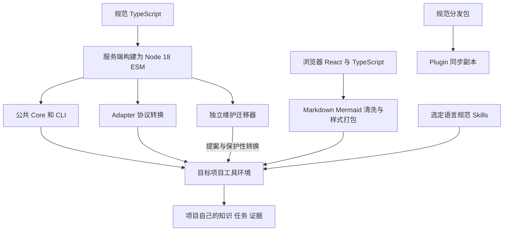

# Core、Skill、Adapter 与构建分发

## 为什么需要项目级 Harness

Agent 产品的 Harness 提供模型与工具循环、上下文管理、权限和生命周期。Lumine 提供项目级环境：目标、工程边界、方法、知识、进度和证据留在项目里，使换会话、换 Agent 后仍能恢复。二者互补；项目资产不会因为某个产品有更强模型就自动出现，也不能由安装一组脚本替代模型理解。

人通过 README、架构地图和知识树理解工程；Agent 按任务选择规则、知识、源码与证据。Product Spec 保存目标，Exec Plan 保存本次技术变化，Wiki 解释现状，Validation 保存实际观测。共享资产减少重复调查，但不把整个知识库固定塞入每次上下文。

## 哪一层可以修改

唯一规范包是 `skills/lumine-harness/`。TypeScript 在 `src/`，日常 Skills、双语模板与资产在 assets；`.mjs` 由构建生成。Plugin wrapper 通过 rsync 同步规范包，不是第二套实现。源仓维护者修改规范源码后构建与同步，不能只修项目 Runtime 或 wrapper，否则下一次升级会丢失修正并造成安装方式分叉。

Core 统一任务、身份、工作报告和停止条件；Adapter 只翻译宿主输入输出。四个 Skills 提供理解和判断方法，不能把关键词命中当授权或把检查结果当语义正确。阅读器只负责展示与文本定位，不内置模型聊天和任务管理。

## 服务端与阅读器为何分别构建

维护工具链使用源仓约定的较新 Node，正式项目 Runtime 以 Node 18 为目标。`runtime-artifacts.ts` 将规范 TypeScript 映射成正式 `.mjs` 和类型合同；`build-runtime.ts` 在临时目录编译、添加生成标记、改写本地 vendor 引用并检查清单覆盖，避免漏分发或无源文件残留。

YAML 与忽略规则打包成本地 vendor。Mermaid 的绘图依赖由 `build-reader.ts` 用浏览器目标打包，不由 Node 服务端导入。阅读器的动态 chunk、CSS、HTML、许可和内容指纹 manifest 一并分发；只复制主 reader.js 会导致离线打开某类图时缺 chunk。构建一致性检查比较实际内容而非只看文件存在。

浏览器入口是 `reader.tsx`，React 只负责本地阅读界面；Markdown 清洗、Mermaid 渲染和资源仍在浏览器包内。构建先核对并保留旧清单登记的 chunk 与许可旁文件，合并既有许可汇总后生成完整清单；先原子写入依赖，再切换入口，最后更新清单。安装器同样保留未修改且有所有权的旧 chunk，避免已经打开的旧页面立即断图；资源随版本累积会增加体积。回滚可以删除升级新建的 chunk，已打开的新入口若随后请求它，会保留文字并提示重载当前阅读器。采用与回滚细节见[迁移恢复](lumine-adoption#cas-and-recovery)。

知识正文不属于 Runtime 模板。升级不能用旧受管文件淘汰逻辑删除 `.lumine/wiki-state/`、任务与项目检查扩展。模型撰写的知识、人工决定和恢复候选都可能是唯一资产，不能当作可重新下载的工具副本。

## 中英文与两种安装保持同一行为

中文规范在 assets，英文条目用 `SKILL.md.template` 避免递归发现重复 Skill。安装时选定一种语言，去掉 template 后缀，目标项目只有四个日常入口。行为标记、Runtime 和验收共用，语言切换不应引入另一套状态或授权逻辑。维护入口 lumine-harness 负责采用与升级，不成为第五个日常阶段。

源仓自用 root manifest 将 skills 指向规范资产、runtime 指向构建目录；采用项目则指向自己的 `.agents/skills` 与 `.lumine`。两者的项目状态仍各自保存，不能根据当前 cwd 猜资源根。详情见配置与根解析专题。

## 构建故障与修改验证

新增服务端模块或迁移模块后，需要检查清单映射、生成物 import 路径和正式分发测试。源码测试能从源码仓依赖解析的模块，在安装包中未必存在；本轮就以分发回归覆盖共享阅读模型和 YAML AST 导出，避免只在开发环境可运行。

维护顺序是 typecheck、Runtime build、源码与分发测试、build consistency、Skill 包检查、Plugin sync 与一致性检查。涉及阅读交互另做浏览器验收；涉及宿主生命周期另看真实事件。正式包脱离源码仓依赖、无缓存和无模型调用仍应可阅读检索已有 Wiki 并绘图。此页说明构建与职责，不声称当前改动已发布、所有宿主已运行或用户已接受。

<!-- lumine-wiki-metadata:v1
{
  "tags": [
    "architecture",
    "架构",
    "build distribution",
    "分发"
  ],
  "aliases": [
    "architecture",
    "架构",
    "build distribution",
    "分发",
    "Agent Harness",
    "Project Harness",
    "runtimeArtifacts",
    "offline"
  ],
  "repositories": [
    "project"
  ],
  "sources": [
    {
      "id": "position",
      "repoId": "project",
      "path": "README.zh-CN.md",
      "startLine": 1,
      "endLine": 175,
      "kind": "source"
    },
    {
      "id": "core",
      "repoId": "project",
      "path": "skills/lumine-harness/src/harness/core/session-context.ts",
      "startLine": 1,
      "endLine": 61,
      "kind": "source"
    },
    {
      "id": "routing",
      "repoId": "project",
      "path": "skills/lumine-harness/src/harness/core/phase-router.ts",
      "startLine": 1,
      "endLine": 152,
      "kind": "source"
    },
    {
      "id": "build",
      "repoId": "project",
      "path": "scripts/build-runtime.ts",
      "startLine": 1,
      "endLine": 217,
      "kind": "source"
    },
    {
      "id": "manifest",
      "repoId": "project",
      "path": "scripts/runtime-artifacts.ts",
      "startLine": 1,
      "endLine": 63,
      "kind": "source"
    },
    {
      "id": "reader",
      "repoId": "project",
      "path": "scripts/build-reader.ts",
      "startLine": 1,
      "endLine": 199,
      "kind": "source"
    },
    {
      "id": "wrapper",
      "repoId": "project",
      "path": "scripts/sync-plugin-wrapper.sh",
      "startLine": 1,
      "endLine": 15,
      "kind": "source"
    },
    {
      "id": "sync-check",
      "repoId": "project",
      "path": "scripts/check-repo-sync.sh",
      "startLine": 1,
      "endLine": 38,
      "kind": "source"
    },
    {
      "id": "manager",
      "repoId": "project",
      "path": "skills/lumine-harness/src/scripts/harness-manager.ts",
      "startLine": 1,
      "endLine": 1052,
      "kind": "source"
    }
  ],
  "relations": [
    {
      "target": "lumine-root-config",
      "kind": "depends_on",
      "note": "所有运行与来源以登记根和身份定位"
    },
    {
      "target": "lumine-workflow",
      "kind": "related",
      "note": "模型工作方法与文档职责"
    },
    {
      "target": "lumine-adapters",
      "kind": "related",
      "note": "宿主具体协议和能力边界"
    },
    {
      "target": "lumine-adoption",
      "kind": "related",
      "note": "安装与升级如何选择这些资源"
    },
    {
      "target": "lumine-wiki",
      "kind": "related",
      "note": "知识生产与确定性工具的分工"
    }
  ],
  "watchScopes": [
    {
      "repoId": "project",
      "path": "README.zh-CN.md"
    },
    {
      "repoId": "project",
      "path": "skills/lumine-harness/src/harness/core/session-context.ts"
    },
    {
      "repoId": "project",
      "path": "skills/lumine-harness/src/harness/core/phase-router.ts"
    },
    {
      "repoId": "project",
      "path": "scripts/build-runtime.ts"
    },
    {
      "repoId": "project",
      "path": "scripts/runtime-artifacts.ts"
    },
    {
      "repoId": "project",
      "path": "scripts/build-reader.ts"
    },
    {
      "repoId": "project",
      "path": "scripts/sync-plugin-wrapper.sh"
    },
    {
      "repoId": "project",
      "path": "scripts/check-repo-sync.sh"
    },
    {
      "repoId": "project",
      "path": "skills/lumine-harness/src/scripts/harness-manager.ts"
    }
  ],
  "diagrams": [
    {
      "id": "layers",
      "title": "从规范源码到项目环境",
      "caption": "服务端与浏览器分别打包，知识和任务保存在项目，不由工具升级重新生成。",
      "sources": [
        "build",
        "manifest",
        "reader",
        "wrapper",
        "manager"
      ]
    }
  ]
}
-->
