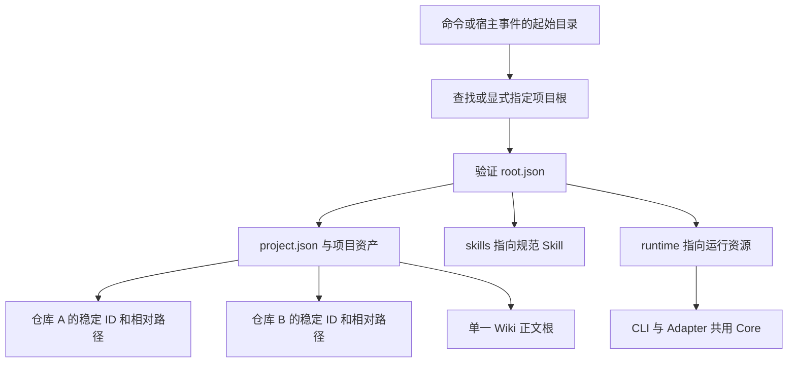

# 项目配置、根解析与多仓身份

## 一个项目根，可以协调多个仓库

Lumine 的项目根是同时容纳工程约定、任务、知识和维护状态的工作范围。它由 `.lumine/root.json` 标记，不要求它本身是 Git 仓库。只有一个代码仓时，项目根通常就是代码仓根；前后端分别管理 Git 时，可以把共同父目录作为项目根。这样，知识可以解释跨仓请求链，而提交、分支和发布仍然保持各仓边界。

要区分三个问题：**我在哪个项目工作、我正在使用哪份运行资源、这条事实来自哪个仓库。** 根声明确定项目身份并指向运行资源，`.lumine/project.json` 的 `repositories` 回答来源仓库身份。可选的 `displayName` 仅作为阅读器中的项目名称；它不替代根声明的 `projectId`，也不改变仓库 ID。仅仅在目录里看见 `.git`，不能回答这些问题。

## 从命令或宿主事件找到正确的根

CLI 支持显式 `--root` 的命令先验证指定根；宿主入口通常从事件的 `cwd` 开始向上寻找 `.lumine/root.json`，找不到时再尝试 `workspaceRoots` 和进程工作目录。查找跨越普通目录及嵌套 Git 根，在遇到有效 Harness 标记时停止。

根声明必须是 `kind: lumine-root`、`schemaVersion: 2`。迁移还处在 `creating` 或 `applying` 时，普通根解析拒绝运行，以免读到一半替换的资源；其他未完成状态可以用于检查和恢复，但不代表迁移已结束。这个检查是维护状态检查，不能替代宿主真实调用的证据。

如果共同父目录和子目录各自已有 Harness 标记，向上查找会选择最近的标记。解析器不会猜哪一个符合人的业务意图，也不会合并两个项目。因此跨仓操作应使用已确认的共同根，必要时显式传 `--root`。根声明中的项目身份用于维护记录；这里的查找逻辑本身并不做“扫描所有根并自动仲裁”的工作。

图中的路径来自根声明和配置，箭头表示解析关系，不表示把仓库内容复制进 Runtime。来源：`root-resolution`、`package-layout`、`config-schema`。

## 自用源仓和安装项目为什么能共用实现

普通安装把 Runtime 放在项目 `.lumine/`，Skill 放在 `.agents/skills/`。源码仓自用时，根声明可以把 `runtime` 指向规范构建产物，把 `skills` 指向规范 Skill 资源。项目的配置、任务和会话仍归项目根所有，不搬进被分发的 Runtime。

`projectRuntimeRoot` 与 `canonicalSkillsRoot` 都先读取根声明，再安全解析相对路径。另一组 `runtime-layout` 工具从模块位置反查规范包或运行目录，用于源码执行及分发资源定位。前者回答“这个项目选择了哪份资源”，后者回答“当前模块属于哪个包”。新增 Adapter 或 CLI 时若直接拼 `.lumine/adapter-capabilities.json`，容易在源仓自用时读错位置；应延续相应解析器。

这也解释了升级边界：更新可分发代码，不应覆盖 `.lumine/tasks/` 和 `.lumine/wiki-state/` 等项目资产。运行资源位置可变，项目资料的归属不随它改变。

## 仓库身份稳定，物理路径可以调整

每个 `repositories` 条目有唯一 `id` 和相对项目根的 `path`。例如 `client` 可以指向 `client/`，`api` 指向 `services/api/`。Wiki 来源和验证证据使用 `repoId + 仓库内相对路径`，而不是本机绝对路径。后续目录调整时，应保留 `repoId` 并更新登记路径；改 ID 会影响所有来源、监控范围和代码基线，不能视作单纯改名。

`wiki.root` 默认 `docs/repo-wiki`，一个项目只有一个正文根。`wiki.watchScopes` 则可以覆盖多个登记仓库，且每条范围必须归属于现有 `repoId`。配置未指定监控范围时，默认监控各登记仓库的 `.`。Agent 检索预算默认最多六张卡片、总计 12000 字符；这是上下文控制，不是项目只允许六个知识主题。浏览器搜索独立分页。需要将历史验证 Markdown 纳入浏览器的全部范围搜索时，`wiki.searchValidationFiles` 只接受 `docs/validation/` 下的准确文件路径，不接受目录或通配符；这些记录不替代 Wiki 的现状解释。

登记路径可以暂时不存在，便于克隆部分多仓项目后先读既有资料。**允许登记缺失仓库不等于其事实已核实。** 任务检查实际读取代码基线时会报告缺失；知识的来源检查也必须保留缺失状态，不能用已有说明代替源码。

## 路径约束与会话隔离

路径解析拒绝绝对路径、空值、空字符、`..` 越界，并检查最终真实位置。即使目标文件尚未创建，也会检查最近已存在父目录的符号链接，防止新路径借由链接落到允许范围之外。来源登记不能用一个越界链接把任意本机文件纳入项目。

会话状态位于 `.lumine/local/runtime/sessions/`，文件身份包含宿主、清理后的会话名称及原会话 ID 的哈希。哈希避免 `a/b` 和 `a_b` 这类名称清理后发生覆盖。`current` 指针用于发现和展示最近会话；写入任务或状态时仍应显式提供宿主及会话 ID，不能把“最近”当“当前授权对象”。

路径边界保护文件访问，不负责授予业务修改、提交或发布权限；这些仍来自用户请求和项目规则。

## 找错位置或配置错误时怎样恢复

| 现象 | 应先核对什么 | 恢复边界 |
|---|---|---|
| 找不到根 | 启动目录是否位于确认的项目内，标记是否存在 | 显式选择根，不新建另一套状态凑数 |
| 新旧配置版本不支持 | 维护提案和迁移是否完成 | 使用维护工具转换，不在 Runtime 增加旧字段别名 |
| 源仓可运行、安装项目失败 | 根声明的 Runtime 路径及正式分发完整性 | 修正资源定位或重建分发，不手改生成文件 |
| 仓库或来源缺失 | 登记 ID、相对路径与实际检出情况 | 保留可读知识，报告来源尚不可验证 |
| 路径或链接越界 | 文件最终真实位置 | 调整登记范围，不绕过边界读取 |

## 修改这层会影响哪些验证

根解析影响 CLI、Hook、共享 Skill、任务证据和知识服务，不能只从仓库顶层跑一次命令。至少覆盖普通安装、源仓自用、非 Git 父目录、从子仓启动、显式根、缺失仓库及符号链接越界。`core-v2.test.ts` 已提供其中的核心夹具，源仓与正式分发还应分别验证。

这里的设计动机来自源码结构推断：稳定身份减少目录变化的连锁影响，共用解析器减少“在某个工作目录恰好可用”的隐患。源码能证明解析路径，不能证明所有宿主都会传入预期 `cwd`；真实宿主边界见关联的 Adapter 专题。

<!-- lumine-wiki-metadata:v1
{
  "tags": [
    "配置",
    "根目录",
    "多仓",
    "repository identity",
    "root resolver",
    "configuration"
  ],
  "aliases": [
    "配置",
    "根目录",
    "多仓",
    "repository identity",
    "root resolver",
    "configuration"
  ],
  "repositories": [
    "project"
  ],
  "sources": [
    {
      "id": "root-resolution",
      "repoId": "project",
      "path": "skills/lumine-harness/src/harness/core/root-resolver.ts",
      "startLine": 6,
      "endLine": 44,
      "kind": "source"
    },
    {
      "id": "path-boundary",
      "repoId": "project",
      "path": "skills/lumine-harness/src/harness/core/project-config.ts",
      "startLine": 28,
      "endLine": 41,
      "kind": "source"
    },
    {
      "id": "config-schema",
      "repoId": "project",
      "path": "skills/lumine-harness/src/harness/core/project-config.ts",
      "startLine": 43,
      "endLine": 120,
      "kind": "source"
    },
    {
      "id": "package-layout",
      "repoId": "project",
      "path": "skills/lumine-harness/src/harness/core/runtime-layout.ts",
      "startLine": 15,
      "endLine": 41,
      "kind": "source"
    },
    {
      "id": "session-location",
      "repoId": "project",
      "path": "skills/lumine-harness/src/harness/core/work-status.ts",
      "startLine": 110,
      "endLine": 207,
      "kind": "source"
    },
    {
      "id": "evidence-root",
      "repoId": "project",
      "path": "skills/lumine-harness/src/harness/core/task-contract.ts",
      "startLine": 111,
      "endLine": 131,
      "kind": "source"
    },
    {
      "id": "root-tests",
      "repoId": "project",
      "path": "skills/lumine-harness/src/harness/tests/core-v2.test.ts",
      "startLine": 1,
      "endLine": 450,
      "kind": "source"
    }
  ],
  "relations": [
    {
      "target": "lumine-architecture",
      "kind": "related",
      "note": "返回整体职责与构建分发"
    },
    {
      "target": "lumine-workflow",
      "kind": "related",
      "note": "任务使用此处的项目与仓库身份"
    },
    {
      "target": "lumine-adapters",
      "kind": "related",
      "note": "宿主事件也使用相同根解析"
    },
    {
      "target": "lumine-wiki",
      "kind": "related",
      "note": "知识来源按仓库登记定位"
    }
  ],
  "diagrams": [
    {
      "id": "root-and-assets",
      "title": "项目身份与运行资源如何分离",
      "caption": "从子仓启动先向上找到根声明，再分别解析项目状态、规范 Skill 和 Runtime。Git 边界不参与这次向上查找。",
      "sources": [
        "root-resolution",
        "package-layout",
        "config-schema"
      ]
    }
  ],
  "sections": [
    {
      "id": "root-answer",
      "sources": [
        "root-resolution",
        "config-schema"
      ]
    },
    {
      "id": "root-selection",
      "sources": [
        "root-resolution"
      ]
    },
    {
      "id": "root-assets",
      "sources": [
        "root-resolution",
        "package-layout"
      ]
    },
    {
      "id": "repo-identity",
      "sources": [
        "config-schema",
        "evidence-root"
      ]
    },
    {
      "id": "root-boundaries",
      "sources": [
        "path-boundary",
        "session-location"
      ]
    },
    {
      "id": "root-failure",
      "sources": [
        "root-resolution",
        "config-schema"
      ]
    },
    {
      "id": "root-change",
      "sources": [
        "root-tests"
      ]
    }
  ],
  "watchScopes": [
    {
      "repoId": "project",
      "path": "skills/lumine-harness/src/harness/core/root-resolver.ts"
    },
    {
      "repoId": "project",
      "path": "skills/lumine-harness/src/harness/core/project-config.ts"
    },
    {
      "repoId": "project",
      "path": "skills/lumine-harness/src/harness/core/runtime-layout.ts"
    },
    {
      "repoId": "project",
      "path": "skills/lumine-harness/src/harness/core/work-status.ts"
    },
    {
      "repoId": "project",
      "path": "skills/lumine-harness/src/harness/core/task-contract.ts"
    },
    {
      "repoId": "project",
      "path": "skills/lumine-harness/src/harness/tests/core-v2.test.ts"
    }
  ]
}
-->
